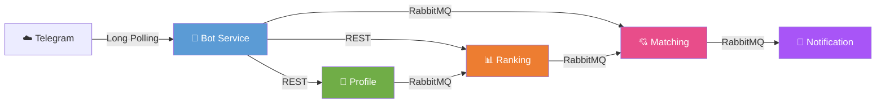

# Dating Bot — микросервисное приложение для знакомств

Telegram-бот для знакомств, построенный на микросервисной архитектуре. Пользователи создают анкеты, просматривают ленту кандидатов с рейтингом и семантической совместимостью, ставят лайки/дизлайки, получают уведомления о мэтчах и могут оценивать друг друга.

> 📋 **Основной файл проекта — [`docs/report_criteria.md`](docs/report_criteria.md):** подробный разбор соответствия критериям оценивания, файловая структура, номера строк ключевых функций и обоснования по всем пунктам.



---

## Архитектура

Проект состоит из **5 микросервисов** и **инфраструктурных компонентов**, собранных в Docker Compose:

| Сервис | Технологии | Порт | Назначение |
|:-------|:-----------|:-----|:-----------|
| **Bot Service** | aiogram 3.x, aiohttp, redis.asyncio | — | Telegram-интерфейс, FSM, i18n (ru/en) |
| **Profile Service** | FastAPI, SQLAlchemy 2, MinIO | `8001` | CRUD анкет, фото, предпочтения, рефералы |
| **Ranking Service** | FastAPI, SQLAlchemy, Redis, Celery | `8002` | Рейтинги L1/L2/L3 + peer, лента, кэш |
| **Matching Service** | FastAPI, SQLAlchemy, aio-pika | `8003` | Свайпы, мэтчи, peer reviews (оценки 1.0–5.0) |
| **Notification Service** | aio-pika, aiohttp | — | Уведомления о мэтчах/лайках/рефералах + icebreaker |

**Инфраструктура:** PostgreSQL 16, Redis 7, RabbitMQ 3.12, MinIO (S3), Prometheus + Grafana, Celery + Beat.

**Стек:** Python 3.11+, FastAPI, aiogram 3.x, SQLAlchemy 2.0, Alembic, Docker Compose.

---

## Документация

Вся детальная документация находится в `docs/`:

| Файл | Описание |
|:-----|:---------|
| **[`docs/report_criteria.md`](docs/report_criteria.md)** | **📋 Основной файл проекта — подробный разбор критериев оценивания, файловая структура, номера строк, обоснования** |
| [`docs/architecture.md`](docs/architecture.md) | Общая архитектура, потоки данных (sequence diagrams), стек технологий, принципы |
| [`docs/database.md`](docs/database.md) | ER-диаграмма, схема БД, таблицы, индексы, формулы рейтинга, Redis-кэш |
| [`docs/services.md`](docs/services.md) | API endpoints и логика каждого микросервиса |
| [`docs/user_scenarios.md`](docs/user_scenarios.md) | Пользовательские сценарии (use cases) с sequence diagrams |
| [`docs/report_criteria.md`](docs/report_criteria.md) | **Отчёт о соответствии критериям оценивания** — детальный разбор по каждому пункту |
| [`docs/tech_stack.md`](docs/tech_stack.md) | **Отчёт по стеку технологий** — что по заданию, что подключено дополнительно и обоснования |
| [`docs/jmeter_results.md`](docs/jmeter_results.md) | Результаты нагрузочного тестирования (JMeter) |

---

## Соответствие критериям оценивания

| № | Критерий | Баллы | Статус | Ключевые файлы |
|---|:---------|:-----:|:------:|:---------------|
| 1 | **Рейтинг L1/L2/L3** | 3 | ✅ | `ranking-service/app/formulas.py`, `tasks.py` |
| 2 | **Redis** | 2 | ✅ | `feed_service.py` (кэш ленты), `bot-service/main.py` (FSM) |
| 3 | **Celery** | 2 | ✅ | `tasks.py`, `celery_app.py`, `docker-compose.yml` |
| 4 | **MQ брокер (RabbitMQ)** | 2 | ✅ | `_shared/events.py`, `swipe_publisher.py`, `consumer.py` |
| 5 | **Метрики и логирование** | 2 | ✅ | `_shared/metrics.py`, `_shared/logging.py`, Prometheus + Grafana |
| 6 | **S3 хранилище (MinIO)** | 2 | ✅ | `profile-service/app/minio_service.py` |
| 7 | **CI/CD (GitHub Actions)** | 1 | ✅ | `.github/workflows/ci.yml` |
| 8 | **Доп. технологии** | 2+ | ✅ | Peer reviews, semantic matching, i18n, circuit breaker, icebreaker |
| 9 | **Этапы продукта** | 13+ | ✅ | Все этапы закрыты (планирование, база, анкеты, БД, JMeter, notification) |


> Полный детальный отчёт с разбором каждого пункта — в [`docs/report_criteria.md`](docs/report_criteria.md).

---

## Дополнительный функционал (доп. баллы)

| Фича | Описание | Где реализовано |
|:-----|:---------|:----------------|
| **Peer Reviews** | Оценка мэтчей 1.0–5.0 (шаг 0.1), Bayesian smoothing в рейтинге | `matching-service/routes.py`, `ranking-service/formulas.py` |
| **Semantic Interest Boost** | Cosine similarity для пересечения интересов в ленте | `ranking-service/embeddings.py`, `bot-service/embeddings.py` |
| **i18n (ru/en)** | Полная многоязычность с переключением `/lang` | `bot-service/i18n.py`, `locales/ru.json`, `locales/en.json` |
| **Icebreaker** | Шаблонные вопросы для разговора на основе пересечения интересов мэтча | `notification-service/icebreaker.py` |
| **Like Notifications** | Уведомление "Кому-то понравилась твоя анкета!" | `matching-service/consumer.py`, `notification-service/consumer.py` |
| **Referral Notifications** | Уведомление пригласившему о новом реферале | `profile-service/routes.py`, `notification-service/consumer.py` |
| **Circuit Breaker** | Защита HTTP-клиентов бота от каскадных отказов | `_shared/circuit_breaker.py`, `bot-service/api_client.py` |
| **Photo Proxy / Media Group** | Карусель из 5 фото через `InputMediaPhoto` | `bot-service/photo_proxy.py`, `handlers/menu.py` |
| **Album Middleware** | Приём нескольких фото за раз при регистрации | `bot-service/middlewares.py` |
| **Инвалидация кэша при review** | Мгновенный пересчёт peer_score + combined_score и сброс Redis-кэша ленты после новой оценки | `ranking-service/tasks.py`, `ranking-service/consumers.py` |
| **Likes Feed** | Лента пользователей, которые тебя лайкнули | `matching-service/routes.py`, `bot-service/handlers/menu.py` |

---

## Быстрый старт

### 1. Клонирование и подготовка

```bash
git clone <repo-url>
cd ulsu
cp .env.example .env
```

### 2. Получи токен бота

1. Открой Telegram, найди **@BotFather**
2. Напиши `/newbot`, следуй инструкциям
3. Скопируй токен в `.env`:

```env
TELEGRAM_BOT_TOKEN=123456789:ABCdef...
```

### 3. Запуск

```bash
docker-compose up -d
```

Поднимется всё:
- ✅ PostgreSQL (порт `55432`)
- ✅ Redis (`6379`)
- ✅ RabbitMQ (`5672` + Management UI `15672`)
- ✅ MinIO S3 (`9000` + Console `9001`)
- ✅ Profile Service (`8001`)
- ✅ Ranking Service (`8002`)
- ✅ Matching Service (`8003`)
- ✅ Bot Service (polling Telegram)
- ✅ Notification Service
- ✅ Celery Worker + Beat
- ✅ Prometheus (`9090`) + Grafana (`3000`)

### 4. Проверка

```bash
# Статус контейнеров
docker-compose ps

# Profile Service API
curl http://localhost:8001/health

# Ranking Service API
curl http://localhost:8002/health

# Matching Service API
curl http://localhost:8003/health
```

### 5. Пользуйся ботом

1. Открой Telegram, найди своего бота
2. Отправь `/start`
3. Пройди регистрацию (имя, возраст, пол, город, bio, интересы, фото, фильтры)
4. Главное меню: смотри анкеты, ставь лайки, проверяй мэтчи!

### 6. Мониторинг

| Сервис | URL | Логин / Пароль |
|:-------|:----|:---------------|
| **Grafana** | http://localhost:3000 | `admin` / `admin` |
| **Prometheus** | http://localhost:9090 | — |
| **MinIO Console** | http://localhost:9001 | `minio_user` / `minio_pass` |
| **RabbitMQ Management** | http://localhost:15672 | `dating_user` / `dating_pass` |

### 7. Тесты

```bash
# Запуск тестов всех сервисов
pytest services/bot-service/tests/ \
       services/profile-service/tests/ \
       services/matching-service/tests/ \
       services/ranking-service/tests/ \
       services/notification-service/tests/
```

### 8. Нагрузочное тестирование (JMeter)

Полная инструкция — в [`docs/jmeter_results.md`](docs/jmeter_results.md).

Кратко:

```bash
# Посеять тестовых пользователей
python3 infrastructure/jmeter/seed_users.py

# Запустить JMeter
cd infrastructure/jmeter
jmeter -n \
  -t dating_load_test.jmx \
  -l report.jtl \
  -e -o report \
  -Jhost=localhost -Jranking_port=8002 \
  -Jusers=10 -Jduration=60 -Jramp=10

# Открыть отчёт
open report/index.html
```

---

## Полезные команды

```bash
# Логи бота
docker logs dating-bot-service -f

# Логи Profile Service
docker logs dating-profile-service -f

# Перезапустить сервис
docker-compose restart bot-service

# Остановить всё
docker-compose down

# Остановить и удалить данные (осторожно!)
docker-compose down -v
```

---

## Структура репозитория

```
.
├── docs/                       # Документация
│   ├── architecture.md         # Архитектура и потоки данных
│   ├── database.md             # Схема БД
│   ├── services.md             # Описание сервисов
│   ├── user_scenarios.md       # Пользовательские сценарии
│   ├── report_criteria.md      # Отчёт по критериям оценивания
│   └── jmeter_results.md       # Результаты JMeter
├── services/                   # Микросервисы
│   ├── _shared/                # Общие библиотеки (logging, metrics, circuit breaker, RabbitMQ)
│   ├── bot-service/            # Telegram-бот
│   ├── profile-service/        # Профили и фото
│   ├── ranking-service/        # Рейтинги и лента
│   ├── matching-service/       # Свайпы и мэтчи
│   └── notification-service/   # Уведомления
├── infrastructure/             # Инфраструктура
│   ├── grafana/                # Dashboards и provisioning
│   ├── prometheus/             # Конфигурация Prometheus
│   └── jmeter/                 # JMeter test-plan и отчёты
├── docker-compose.yml          # Orchestration всех сервисов
├── .env.example                # Пример переменных окружения
└── README.md                   # Этот файл
```

