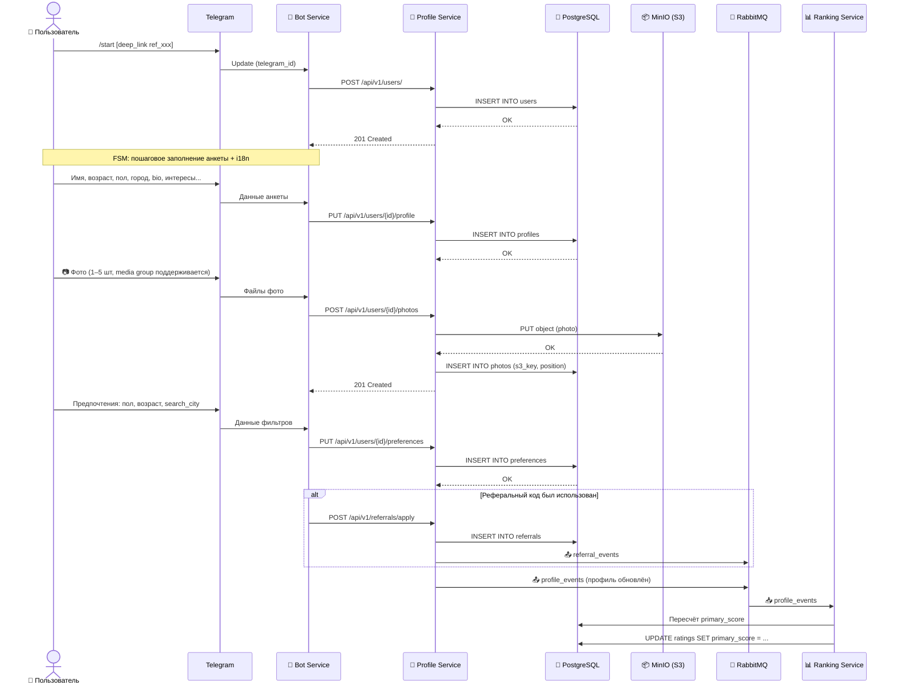
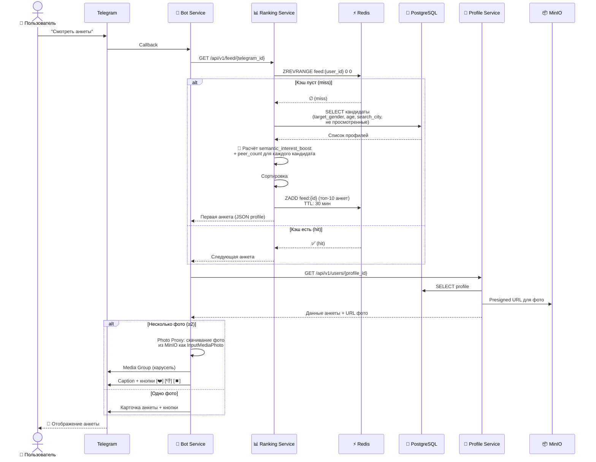
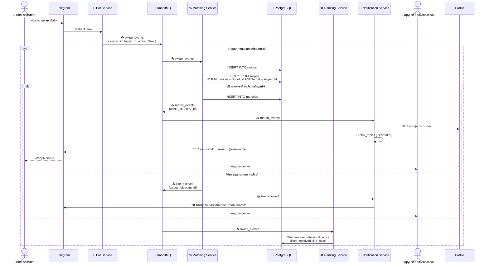
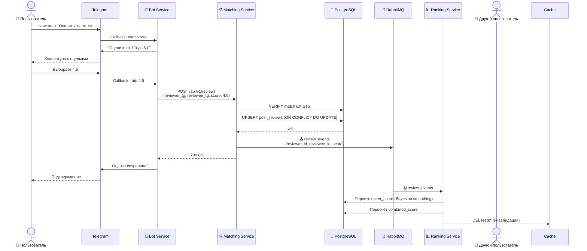
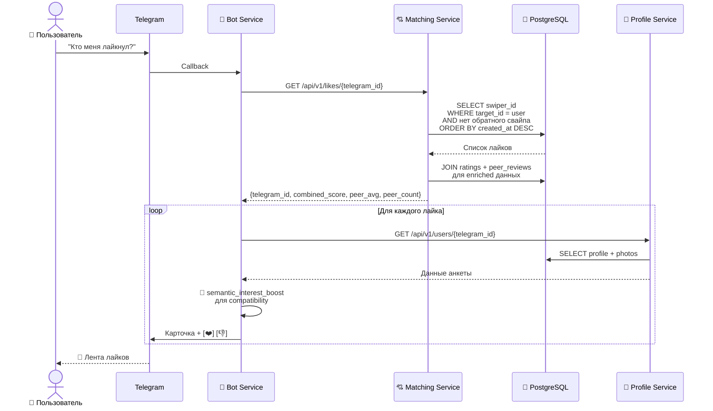
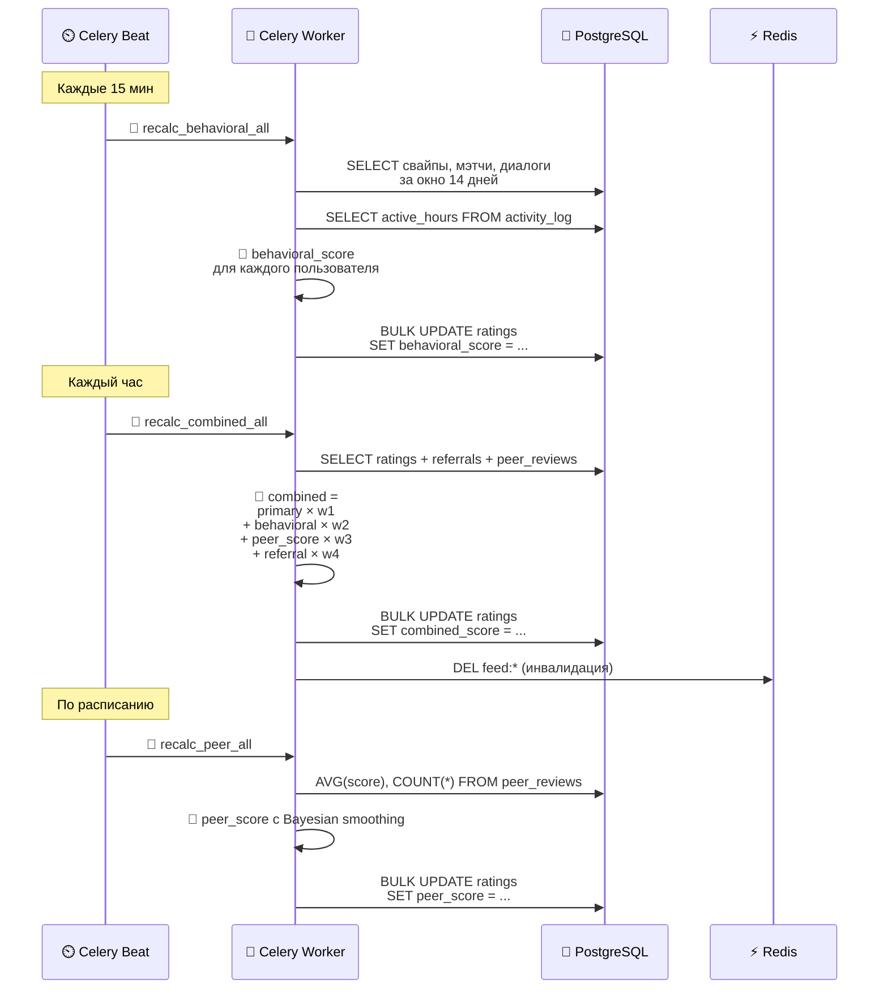

# Архитектура системы Dating Bot

## Общая схема системы

```mermaid
graph TB
    subgraph TELEGRAM["☁️ Telegram Cloud"]
        TG_API["Telegram Bot API"]
    end

    subgraph DOCKER["🐳 Docker Compose"]

        subgraph SERVICES["⚙️ Микросервисы"]
            BOT["🤖 Bot Service<br/><i>aiogram 3.x</i><br/>─────────<br/>Команды, FSM, i18n,<br/>показ анкет, свайпы,<br/>peer reviews, лайки"]
            PROFILE["👤 Profile Service<br/><i>FastAPI</i><br/>─────────<br/>CRUD анкет,<br/>загрузка фото,<br/>рефералы"]
            RANKING["📊 Ranking Service<br/><i>FastAPI</i><br/>─────────<br/>Рейтинги, лента,<br/>semantic matching"]
            MATCHING["💘 Matching Service<br/><i>FastAPI</i><br/>─────────<br/>Свайпы, мэтчи,<br/>peer reviews"]
            NOTIFY["🔔 Notification Service<br/><i>aio-pika</i><br/>─────────<br/>Мэтчи, лайки,<br/>рефералы, icebreaker"]
        end

        subgraph INFRA["🏗️ Инфраструктура"]
            PG[("🐘 PostgreSQL 16<br/>─────────<br/>users, profiles,<br/>swipes, matches,<br/>ratings, referrals,<br/>peer_reviews,<br/>activity_log")]
            REDIS[("⚡ Redis 7<br/>─────────<br/>Кэш ленты анкет,<br/>FSM storage,<br/>брокер Celery")]
            RMQ["🐇 RabbitMQ 3.12<br/>─────────<br/>swipe_events<br/>match_events<br/>profile_events<br/>referral_events<br/>review_events")]
            MINIO["📦 MinIO<br/><i>S3-совместимое</i><br/>─────────<br/>Хранение фото")]
        end

        subgraph WORKERS["⏰ Фоновые задачи"]
            CELERY_W["🔧 Celery Worker<br/>─────────<br/>Пересчёт рейтингов,<br/>peer score"]
            CELERY_B["⏲️ Celery Beat<br/>─────────<br/>Расписание задач"]
        end

        subgraph MONITORING["📈 Мониторинг"]
            PROM["Prometheus<br/>─────────<br/>Сбор метрик"]
            GRAF["Grafana<br/>─────────<br/>Дашборды"]
        end
    end

    TG_API <-->|"Long Polling"| BOT

    BOT -->|"REST API"| PROFILE
    BOT -->|"REST API"| RANKING
    BOT -->|"Публикация<br/>свайпов"| RMQ

    PROFILE --> PG
    PROFILE -->|"S3 API"| MINIO
    PROFILE -->|"profile_events<br/>referral_events"| RMQ

    RANKING --> PG
    RANKING --> REDIS

    RMQ -->|"swipe_events"| MATCHING
    RMQ -->|"swipe_events"| RANKING
    RMQ -->|"match_events"| NOTIFY
    RMQ -->|"like.received"| NOTIFY
    RMQ -->|"referral_events"| NOTIFY
    RMQ -->|"review_events"| RANKING

    MATCHING --> PG
    MATCHING -->|"match_events<br/>review_events<br/>like.received"| RMQ

    CELERY_B -->|"Расписание"| CELERY_W
    CELERY_W --> PG
    CELERY_W --> REDIS

    PROM -.->|"Scrape /metrics"| PROFILE
    PROM -.->|"Scrape /metrics"| RANKING
    PROM -.->|"Scrape /metrics"| MATCHING
    GRAF -.-> PROM

    style TELEGRAM fill:#54a9eb,color:#fff,stroke:#2d8fd5
    style BOT fill:#5b9bd5,color:#fff,stroke:#4178a4
    style PROFILE fill:#70ad47,color:#fff,stroke:#548235
    style RANKING fill:#ed7d31,color:#fff,stroke:#c45d1a
    style MATCHING fill:#e84d8a,color:#fff,stroke:#c43070
    style NOTIFY fill:#a855f7,color:#fff,stroke:#8b3fd4
    style PG fill:#336791,color:#fff,stroke:#264f6d
    style REDIS fill:#dc382d,color:#fff,stroke:#b42e24
    style RMQ fill:#ff6600,color:#fff,stroke:#cc5200
    style MINIO fill:#c72c48,color:#fff,stroke:#a12039
    style CELERY_W fill:#37b24d,color:#fff,stroke:#2d9140
    style CELERY_B fill:#37b24d,color:#fff,stroke:#2d9140
    style PROM fill:#e6522c,color:#fff,stroke:#c4441f
    style GRAF fill:#f2a70a,color:#fff,stroke:#d09000
```

---

## Потоки данных

### 1. Регистрация и заполнение анкеты



### 2. Просмотр анкет (Feed)



### 3. Свайп и мэтч



### 4. Peer Review (оценка мэтча)



### 5. Просмотр полученных лайков



### 6. Периодический пересчёт рейтингов (Celery)



---

## Стек технологий

| Компонент | Технология | Версия | Назначение |
|:---------:|:----------:|:------:|:-----------|
| 🐍 Язык | **Python** | 3.11+ | Основной язык разработки |
| 🤖 Telegram Bot | **aiogram** | 3.x | Асинхронный фреймворк для Telegram Bot API |
| 🌐 REST API | **FastAPI** | 0.100+ | HTTP API для сервисов |
| 🗄️ ORM | **SQLAlchemy** | 2.0+ | Работа с БД |
| 📋 Миграции | **Alembic** | 1.12+ | Миграции схемы БД |
| 🐘 БД | **PostgreSQL** | 16 | Основное хранилище данных |
| ⚡ Кэш | **Redis** | 7.x | Кэширование ленты, FSM storage, брокер Celery |
| 🐇 Очереди | **RabbitMQ** | 3.12+ | Брокер сообщений между сервисами |
| ⏰ Задачи | **Celery** | 5.3+ | Периодические и отложенные задачи |
| 📦 S3 | **MinIO** | latest | S3-совместимое хранилище фотографий |
| 📈 Метрики | **Prometheus** | latest | Сбор метрик |
| 📊 Дашборды | **Grafana** | latest | Визуализация метрик |
| 🐳 Контейнеры | **Docker + Compose** | latest | Контейнеризация и оркестрация |

---

## Принципы архитектуры

| Принцип | Описание |
|:--------|:---------|
| 🔗 **Слабая связанность** | Сервисы общаются через RabbitMQ — падение одного не ломает другие |
| ⚡ **Асинхронная обработка** | Свайпы, мэтчи, рефералы, reviews — через очередь, не блокируя UI |
| 💾 **Кэширование** | Redis убирает нагрузку с БД при частых запросах к ленте (ZSET + JSON) |
| 👁️ **Наблюдаемость** | Prometheus + Grafana + структурное JSON-логирование |
| 📐 **Горизонтальное масштабирование** | Каждый сервис масштабируется независимо |
| 🔄 **Идемпотентность** | Повторная обработка события (swipe, match, review) не ломает состояние |
| 🛡️ **Circuit Breaker** | Защита от каскадных отказов при недоступности downstream-сервисов |
| 🌍 **Интернационализация** | i18n на уровне Bot Service (ru/en), расширяемая архитектура |
