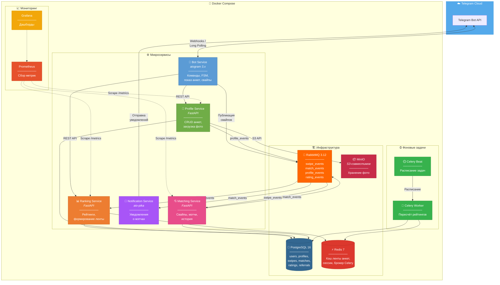
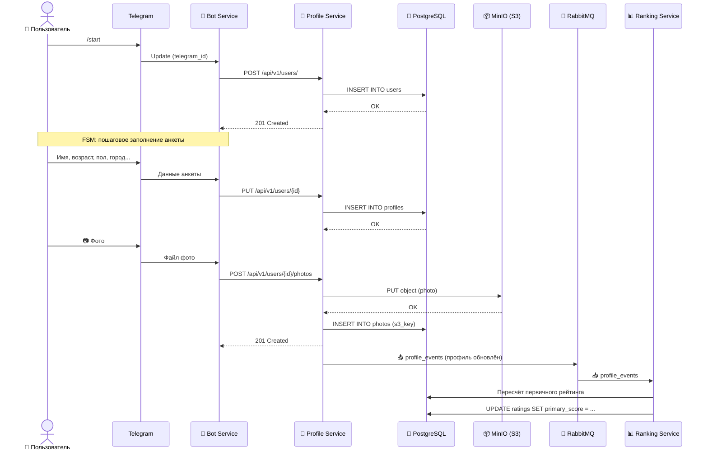
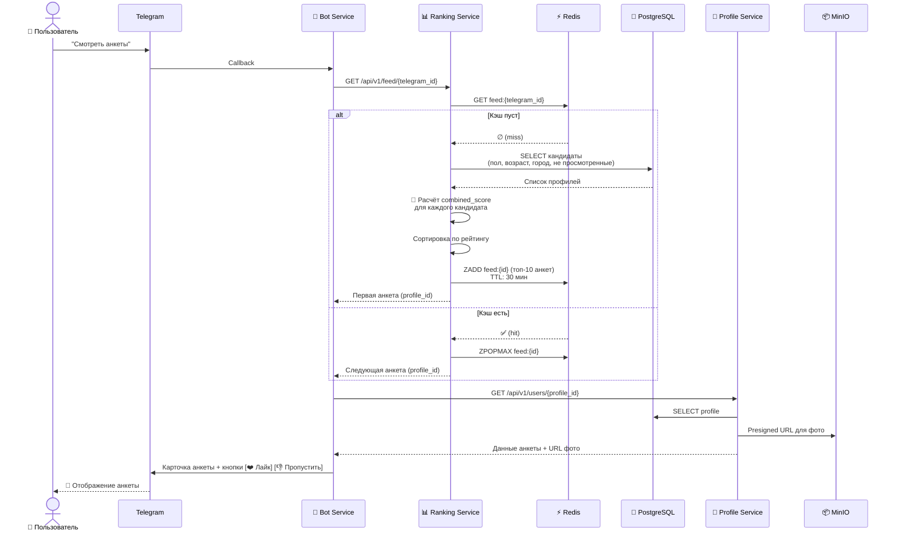
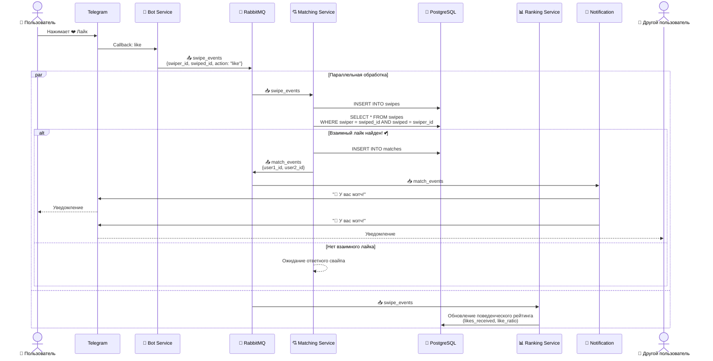
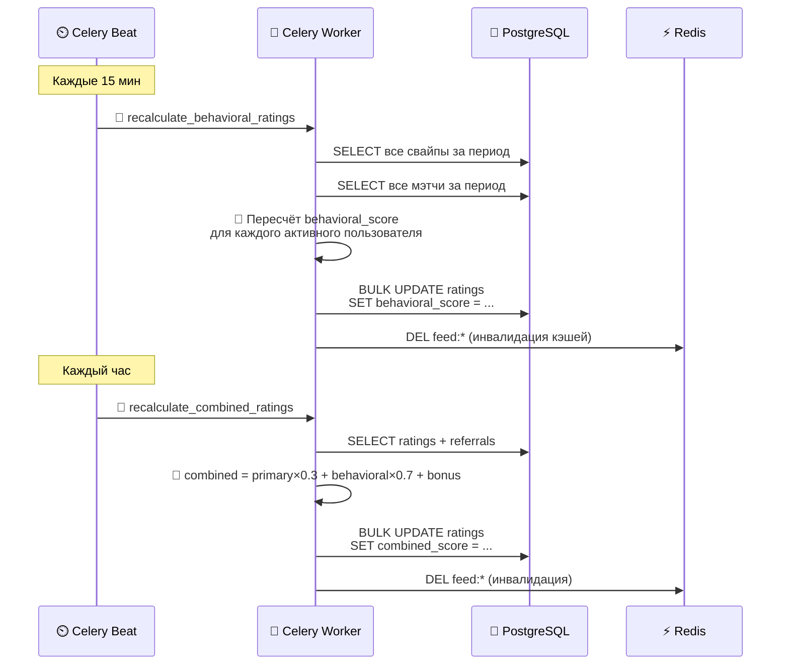

# Архитектура системы Dating Bot

## Общая схема системы

---

## Потоки данных

### 1. Регистрация и заполнение анкеты

### 2. Просмотр анкет (Feed)

### 3. Свайп и мэтч

### 4. Периодический пересчёт рейтингов (Celery)

---

## Стек технологий

| Компонент | Технология | Версия | Назначение |
|:---------:|:----------:|:------:|:-----------|
| 🐍 Язык | **Python** | 3.11+ | Основной язык разработки |
| 🤖 Telegram Bot | **aiogram** | 3.x | Асинхронный фреймворк для Telegram Bot API |
| 🌐 REST API | **FastAPI** | 0.100+ | HTTP API для сервисов |
| 🗄️ ORM | **SQLAlchemy** | 2.0+ | Работа с БД |
| 📋 Миграции | **Alembic** | 1.12+ | Миграции схемы БД |
| 🐘 БД | **PostgreSQL** | 16 | Основное хранилище данных |
| ⚡ Кэш | **Redis** | 7.x | Кэширование, брокер Celery |
| 🐇 Очереди | **RabbitMQ** | 3.12+ | Брокер сообщений между сервисами |
| ⏰ Задачи | **Celery** | 5.3+ | Периодические и отложенные задачи |
| 📦 S3 | **MinIO** | latest | S3-совместимое хранилище фотографий |
| 📈 Метрики | **Prometheus** | latest | Сбор метрик |
| 📊 Дашборды | **Grafana** | latest | Визуализация метрик |
| 🐳 Контейнеры | **Docker + Compose** | latest | Контейнеризация и оркестрация |
| 🚀 CI/CD | **GitHub Actions** | — | Автоматизация сборки и тестов |

---

## Принципы архитектуры

| Принцип | Описание |
|:--------|:---------|
| 🔗 **Слабая связанность** | Сервисы общаются через RabbitMQ — падение одного не ломает другие |
| ⚡ **Асинхронная обработка** | Свайпы обрабатываются через очередь, не блокируя UI |
| 💾 **Кэширование** | Redis убирает нагрузку с БД при частых запросах к ленте |
| 👁️ **Наблюдаемость** | Prometheus + Grafana + структурное логирование |
| 📐 **Горизонтальное масштабирование** | Каждый сервис масштабируется независимо |
| 🔄 **Идемпотентность** | Повторная обработка события не ломает состояние |
