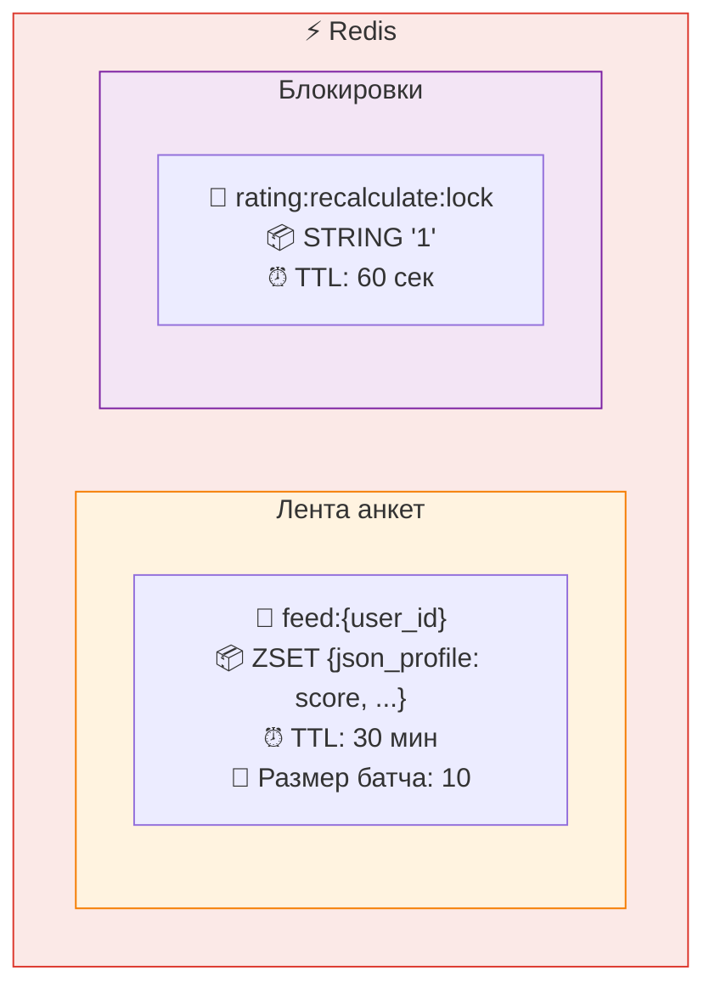

# Схема базы данных Dating Bot

## ER-диаграмма

```mermaid
erDiagram
    users {
        bigint id PK
        bigint telegram_id UK "NOT NULL"
        varchar username "NULLABLE"
        varchar referral_code UK "NOT NULL"
        bigint referred_by FK "NULLABLE → users"
        timestamp created_at "DEFAULT NOW()"
    }

    profiles {
        bigint user_id PK, FK "NOT NULL → users"
        varchar name "NOT NULL"
        smallint age "NOT NULL, CHECK 18..100"
        varchar gender "NOT NULL"
        varchar city "NULLABLE"
        text bio "NULLABLE"
        text_arr interests "NULLABLE, ARRAY(String(32))"
        timestamp last_active_at "DEFAULT NOW()"
        timestamp updated_at "DEFAULT NOW()"
    }

    photos {
        bigint id PK
        bigint user_id FK "NOT NULL → users"
        varchar s3_key "NOT NULL"
        smallint position "DEFAULT 0"
        timestamp created_at "DEFAULT NOW()"
    }

    preferences {
        bigint user_id PK, FK "NOT NULL → users"
        varchar target_gender "NOT NULL (male/female/any)"
        smallint age_min "DEFAULT 18"
        smallint age_max "DEFAULT 99"
        varchar search_city "NULLABLE"
        timestamp updated_at "DEFAULT NOW()"
    }

    swipes {
        bigint id PK
        bigint swiper_id FK "NOT NULL → users"
        bigint target_id FK "NOT NULL → users"
        varchar action "NOT NULL (like/skip)"
        timestamp created_at "DEFAULT NOW()"
    }

    matches {
        bigint id PK
        bigint user1_id FK "NOT NULL → users (меньший ID)"
        bigint user2_id FK "NOT NULL → users (больший ID)"
        timestamp created_at "DEFAULT NOW()"
        timestamp started_dialog_at "NULLABLE"
    }

    ratings {
        bigint user_id PK, FK "NOT NULL → users"
        float primary_score "DEFAULT 0.0"
        float behavioral_score "DEFAULT 0.0"
        float peer_score "DEFAULT 0.0"
        float referral_bonus "DEFAULT 0.0"
        float combined_score "DEFAULT 0.0"
        timestamp updated_at "DEFAULT NOW()"
    }

    referrals {
        bigint id PK
        bigint inviter_id FK "NOT NULL → users"
        bigint invitee_id FK, UK "NOT NULL → users"
        float bonus_value "DEFAULT 0.05"
        timestamp applied_at "DEFAULT NOW()"
    }

    peer_reviews {
        bigint id PK
        bigint reviewer_id FK "NOT NULL → users"
        bigint reviewee_id FK "NOT NULL → users"
        numeric score "NOT NULL, 1.0–5.0, шаг 0.1"
        timestamp created_at "DEFAULT NOW()"
        timestamp updated_at "DEFAULT NOW()"
    }

    activity_log {
        bigint id PK
        bigint user_id FK "NOT NULL → users"
        varchar event_type "NOT NULL"
        smallint hour_of_day "NOT NULL"
        timestamp created_at "DEFAULT NOW()"
    }

    users ||--|| profiles : "1:1 — имеет анкету"
    users ||--|| preferences : "1:1 — имеет предпочтения"
    users ||--|| ratings : "1:1 — имеет рейтинг"
    users ||--o{ photos : "1:N — содержит фото (макс 5)"
    users ||--o{ swipes : "1:N — делает свайпы"
    users ||--o{ matches : "1:N — участвует в мэтчах (user1)"
    users ||--o{ matches : "1:N — участвует в мэтчах (user2)"
    users ||--o{ referrals : "1:N — приглашает (inviter)"
    users ||--o| referrals : "1:1 — приглашён (invitee)"
    users ||--o{ peer_reviews : "1:N — оценивает (reviewer)"
    users ||--o{ peer_reviews : "1:N — получает оценки (reviewee)"
    users ||--o{ activity_log : "1:N — лог активности"
```



---

## Подробное описание таблиц

### 1. `users` — Пользователи

> Базовая сущность. Создаётся при первом `/start` в Telegram.

| Поле | Тип | Ограничения | Описание |
|:-----|:----|:------------|:---------|
| `id` | `BIGSERIAL` | `PRIMARY KEY` | Внутренний ID |
| `telegram_id` | `BIGINT` | `UNIQUE NOT NULL` | Telegram ID пользователя |
| `username` | `VARCHAR(64)` | `NULLABLE` | Telegram username |
| `referral_code` | `VARCHAR(16)` | `UNIQUE NOT NULL` | Уникальный реферальный код |
| `referred_by` | `BIGINT` | `FK → users(id) ON DELETE SET NULL, NULLABLE` | Кто пригласил |
| `created_at` | `TIMESTAMPTZ` | `DEFAULT NOW()` | Дата регистрации |

<details>
<summary>📑 Индексы</summary>

| Имя | Поля | Тип | Назначение |
|:----|:-----|:----|:-----------|
| `idx_users_telegram_id` | `telegram_id` | UNIQUE | Основной поиск по Telegram ID |
| `idx_users_referral_code` | `referral_code` | UNIQUE | Поиск по реферальному коду |

</details>

---

### 2. `profiles` — Анкеты

> Данные анкеты: имя, возраст, пол, город, описание, интересы. Связь 1:1 с `users`.

| Поле | Тип | Ограничения | Описание |
|:-----|:----|:------------|:---------|
| `user_id` | `BIGINT` | `FK → users(id) ON DELETE CASCADE, PRIMARY KEY` | Владелец (1:1) |
| `name` | `VARCHAR(64)` | `NOT NULL` | Имя |
| `age` | `SMALLINT` | `NOT NULL, CHECK(18..100)` | Возраст |
| `gender` | `VARCHAR(16)` | `NOT NULL` | Пол (`male` / `female` / `other`) |
| `city` | `VARCHAR(64)` | `NULLABLE` | Город (нормализуется в lowercase) |
| `bio` | `TEXT` | `NULLABLE` | О себе (до 2000 символов) |
| `interests` | `VARCHAR(32)[]` | `NULLABLE` | Массив интересов (макс 20) |
| `last_active_at` | `TIMESTAMPTZ` | `DEFAULT NOW()` | Время последней активности |
| `updated_at` | `TIMESTAMPTZ` | `DEFAULT NOW()` | Дата последнего обновления |

<details>
<summary>📑 Индексы и ограничения</summary>

| Имя | Поля / Выражение | Тип | Назначение |
|:----|:-----------------|:----|:-----------|
| `ck_profile_age` | `age >= 18 AND age <= 100` | CHECK | Диапазон возраста |
| `ix_profiles_gender_age` | `gender, age` | Composite | Фильтр ленты по полу и возрасту |

</details>

---

### 3. `photos` — Фотографии

> Фотографии анкеты. Файлы хранятся в MinIO (S3), в БД только ключи. Макс. 5 фото на пользователя.

| Поле | Тип | Ограничения | Описание |
|:-----|:----|:------------|:---------|
| `id` | `BIGSERIAL` | `PRIMARY KEY` | ID фото |
| `user_id` | `BIGINT` | `FK → users(id) ON DELETE CASCADE, NOT NULL` | Владелец |
| `s3_key` | `VARCHAR(256)` | `NOT NULL` | Ключ объекта в S3 (MinIO) |
| `position` | `SMALLINT` | `DEFAULT 0` | Порядок отображения |
| `created_at` | `TIMESTAMPTZ` | `DEFAULT NOW()` | Дата загрузки |

---

### 4. `preferences` — Предпочтения поиска

> Настройки фильтра: кого ищу по полу, возрасту, городу.

| Поле | Тип | Ограничения | Описание |
|:-----|:----|:------------|:---------|
| `user_id` | `BIGINT` | `FK → users(id) ON DELETE CASCADE, PRIMARY KEY` | Владелец (1:1) |
| `target_gender` | `VARCHAR(16)` | `NOT NULL` | Кого ищу (`male` / `female` / `any`) |
| `age_min` | `SMALLINT` | `DEFAULT 18, CHECK(≥ 18)` | Мин. возраст |
| `age_max` | `SMALLINT` | `DEFAULT 99, CHECK(≤ 100)` | Макс. возраст |
| `search_city` | `VARCHAR(64)` | `NULLABLE` | Город поиска (`NULL` = любой; нормализуется в lowercase) |
| `updated_at` | `TIMESTAMPTZ` | `DEFAULT NOW()` | Дата обновления |

<details>
<summary>📑 Ограничения</summary>

| Имя | Выражение | Тип | Назначение |
|:----|:----------|:----|:-----------|
| `ck_pref_age_range` | `age_min <= age_max` | CHECK | Корректность диапазона |

</details>

---

### 5. `swipes` — Свайпы (лайки / пропуски)

> Каждый свайп — одна запись. Уникальность на пару `(swiper_id, target_id)`.

| Поле | Тип | Ограничения | Описание |
|:-----|:----|:------------|:---------|
| `id` | `BIGSERIAL` | `PRIMARY KEY` | ID свайпа |
| `swiper_id` | `BIGINT` | `FK → users(id) ON DELETE CASCADE, NOT NULL` | Кто свайпнул |
| `target_id` | `BIGINT` | `FK → users(id) ON DELETE CASCADE, NOT NULL` | Кого свайпнули |
| `action` | `VARCHAR(8)` | `NOT NULL, CHECK('like','skip')` | Действие |
| `created_at` | `TIMESTAMPTZ` | `DEFAULT NOW()` | Время свайпа |

<details>
<summary>📑 Индексы и ограничения</summary>

| Имя | Поля / Выражение | Тип | Назначение |
|:----|:-----------------|:----|:-----------|
| `uq_swipe_pair` | `swiper_id, target_id` | UNIQUE | Один свайп на пару |
| `ck_swipe_action` | `action IN ('like','skip')` | CHECK | Допустимые действия |
| `ck_swipe_self` | `swiper_id <> target_id` | CHECK | Запрет свайпа самого себя |
| `ix_swipes_target_action` | `target_id, action` | Composite | Подсчёт лайков/пропусков |

</details>

---

### 6. `matches` — Мэтчи (взаимные лайки)

> Создаётся при обнаружении взаимного лайка. `user1_id < user2_id` для уникальности.

| Поле | Тип | Ограничения | Описание |
|:-----|:----|:------------|:---------|
| `id` | `BIGSERIAL` | `PRIMARY KEY` | ID мэтча |
| `user1_id` | `BIGINT` | `FK → users(id) ON DELETE CASCADE, NOT NULL` | Первый пользователь (меньший ID) |
| `user2_id` | `BIGINT` | `FK → users(id) ON DELETE CASCADE, NOT NULL` | Второй пользователь (больший ID) |
| `created_at` | `TIMESTAMPTZ` | `DEFAULT NOW()` | Время мэтча |
| `started_dialog_at` | `TIMESTAMPTZ` | `NULLABLE` | Время начала диалога |

<details>
<summary>📑 Индексы и ограничения</summary>

| Имя | Поля / Выражение | Тип | Назначение |
|:----|:-----------------|:----|:-----------|
| `uq_match_pair` | `user1_id, user2_id` | UNIQUE | Один мэтч на пару |
| `ck_match_order` | `user1_id < user2_id` | CHECK | Упорядочивание ID |

</details>

---

### 7. `ratings` — Рейтинги

> Итоговые и промежуточные рейтинги пользователей. Пересчитывается Celery-задачами и реактивно на события.

| Поле | Тип | Ограничения | Описание |
|:-----|:----|:------------|:---------|
| `user_id` | `BIGINT` | `FK → users(id) ON DELETE CASCADE, PRIMARY KEY` | Пользователь |
| `primary_score` | `FLOAT` | `DEFAULT 0.0` | Первичный рейтинг (заполненность профиля) |
| `behavioral_score` | `FLOAT` | `DEFAULT 0.0` | Поведенческий рейтинг (свайпы, мэтчи, диалоги, активность) |
| `peer_score` | `FLOAT` | `DEFAULT 0.0` | Оценки от других пользователей (peer reviews) |
| `referral_bonus` | `FLOAT` | `DEFAULT 0.0` | Бонус за рефералов |
| `combined_score` | `FLOAT` | `DEFAULT 0.0` | **Итоговый комбинированный рейтинг** |
| `updated_at` | `TIMESTAMPTZ` | `DEFAULT NOW()` | Время последнего обновления |

> **Примечание.** Расчётные компоненты (`profile_completeness`, `photo_count_score`, `like_ratio`, `match_ratio`, `activity_score` и др.) вынесены в Python-код (`ranking-service/app/formulas.py`) и не хранятся в БД.

---

### 8. `referrals` — Реферальная система

> Отслеживание приглашений. Один пользователь может быть приглашён только один раз.

| Поле | Тип | Ограничения | Описание |
|:-----|:----|:------------|:---------|
| `id` | `BIGSERIAL` | `PRIMARY KEY` | ID записи |
| `inviter_id` | `BIGINT` | `FK → users(id) ON DELETE CASCADE, NOT NULL` | Пригласивший |
| `invitee_id` | `BIGINT` | `FK → users(id) ON DELETE CASCADE, UNIQUE NOT NULL` | Приглашённый |
| `bonus_value` | `FLOAT` | `DEFAULT 0.05` | Величина бонуса к рейтингу |
| `applied_at` | `TIMESTAMPTZ` | `DEFAULT NOW()` | Время применения реферала |

<details>
<summary>📑 Ограничения</summary>

| Имя | Выражение | Тип | Назначение |
|:----|:----------|:----|:-----------|
| `ck_referral_self` | `inviter_id <> invitee_id` | CHECK | Запрет самоприглашения |
| `uq_referral_invitee` | `invitee_id` | UNIQUE | Один invitee — один реферал |

</details>

---

### 9. `peer_reviews` — Оценки между мэтчами

> После мэтча пользователи могут оценить друг друга по шкале 1.0–5.0 с шагом 0.1. Оценка влияет на `peer_score` в таблице `ratings`.

| Поле | Тип | Ограничения | Описание |
|:-----|:----|:------------|:---------|
| `id` | `BIGSERIAL` | `PRIMARY KEY` | ID оценки |
| `reviewer_id` | `BIGINT` | `FK → users(id) ON DELETE CASCADE, NOT NULL` | Кто оценивает |
| `reviewee_id` | `BIGINT` | `FK → users(id) ON DELETE CASCADE, NOT NULL` | Кого оценивают |
| `score` | `NUMERIC(2,1)` | `NOT NULL` | Оценка (1.0 – 5.0, шаг 0.1) |
| `created_at` | `TIMESTAMPTZ` | `DEFAULT NOW()` | Время создания |
| `updated_at` | `TIMESTAMPTZ` | `DEFAULT NOW()` | Время обновления |

> **Upsert-логика:** при повторной оценке той же пары `reviewer_id + reviewee_id` запись обновляется (`ON CONFLICT DO UPDATE`).

<details>
<summary>📑 Индексы и ограничения</summary>

| Имя | Поля / Выражение | Тип | Назначение |
|:----|:-----------------|:----|:-----------|
| `uq_peer_review_pair` | `reviewer_id, reviewee_id` | UNIQUE | Одна оценка на пару |
| `ck_peer_review_score_range` | `score >= 1.0 AND score <= 5.0` | CHECK | Диапазон оценки |
| `ck_peer_review_score_step` | `score * 10 = floor(score * 10)` | CHECK | Шаг 0.1 |
| `ck_peer_review_no_self` | `reviewer_id <> reviewee_id` | CHECK | Запрет самооценки |
| `ix_peer_reviews_reviewee_id` | `reviewee_id` | B-tree | Подсчёт средней оценки |

</details>

---

### 10. `activity_log` — Лог активности

> Сырые события активности пользователей. Используется для расчёта `behavioral_score` (компонент `active_hours_count`).

| Поле | Тип | Ограничения | Описание |
|:-----|:----|:------------|:---------|
| `id` | `BIGSERIAL` | `PRIMARY KEY` | ID записи |
| `user_id` | `BIGINT` | `FK → users(id) ON DELETE CASCADE, NOT NULL` | Пользователь |
| `event_type` | `VARCHAR(32)` | `NOT NULL` | Тип события (`swipe`, `match`, `message` и т.п.) |
| `hour_of_day` | `SMALLINT` | `NOT NULL` | Час дня (0–23) |
| `created_at` | `TIMESTAMPTZ` | `DEFAULT NOW()` | Время события |

---

## Формулы рейтинга (кратко)

> Подробное описание весов, нормализаций и Celery-расписания см. в `scoring.md`.

### Уровень 1 — Первичный рейтинг (`primary_score`)

Рассчитывается реактивно при обновлении профиля. Компоненты:
- **Заполненность полей** (`name`, `age`, `gender`, `city`, `bio`) + плотность интересов
- **Количество фото** (нормализовано до 5)
- **Наличие предпочтений** (`preferences`)

### Уровень 2 — Поведенческий рейтинг (`behavioral_score`)

Пересчитывается Celery каждые 15 минут по окну в 14 дней. Компоненты:
- Полученные лайки / пропуски
- Соотношение лайков к пропускам
- Взаимные мэтчи
- Начатые диалоги (`started_dialog_at IS NOT NULL`)
- Активность по часам (`activity_log.hour_of_day`)

### Peer score (`peer_score`)

Рассчитывается на основе `peer_reviews` с **Bayesian smoothing** (prior mean и prior weight), чтобы 1–2 оценки не сильно качали рейтинг. Нормализуется относительно нейтрали 3.0.

### Уровень 3 — Комбинированный рейтинг (`combined_score`)

```
combined = primary × w_primary
         + behavioral × w_behavioral
         + peer_score × w_peer
         + referral_norm × w_referral
```

Все компоненты нормализованы в `[0, 1]`, итог капируется в `settings.combined_score_max`.

---

## Структура Redis-кэша



| Ключ | Тип | Содержимое | TTL |
|:-----|:----|:-----------|:----|
| `feed:{user_id}` | `ZSET` | JSON-сериализованные объекты профилей с полями `telegram_id`, `profile`, `compatibility`, `combined_score`, `primary_score`, `peer_rating` | 30 мин |
| `rating:recalculate:lock` | `STRING` | Флаг блокировки параллельного пересчёта | 60 сек |

> **Как работает лента:** при cache miss Ranking Service делает SQL-запрос кандидатов, сортирует по `peer_count` + семантическому overlap интересов, кладёт топ-N в ZSET и отдаёт первый элемент. При cache hit — достаёт из вершины ZSET.
