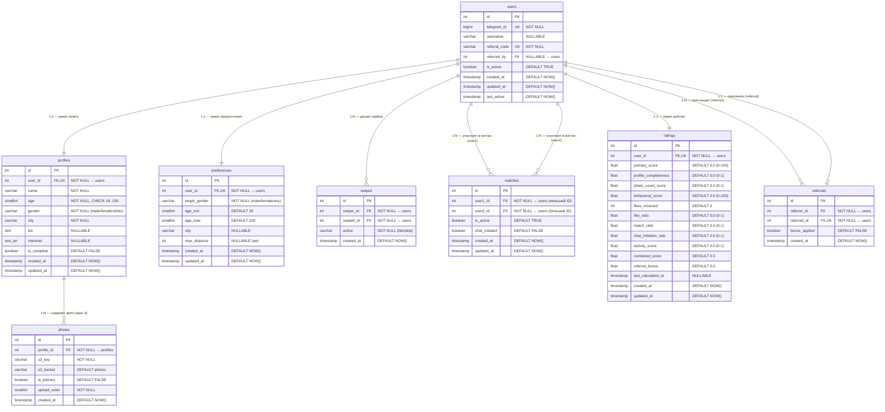
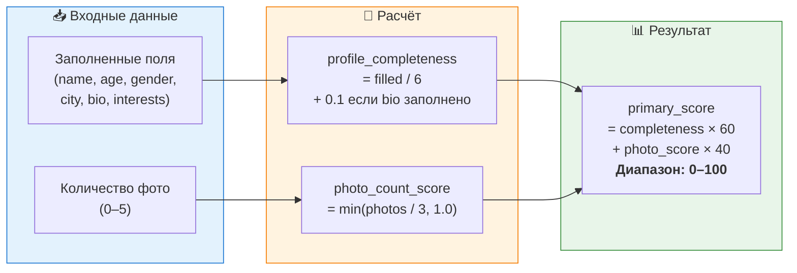
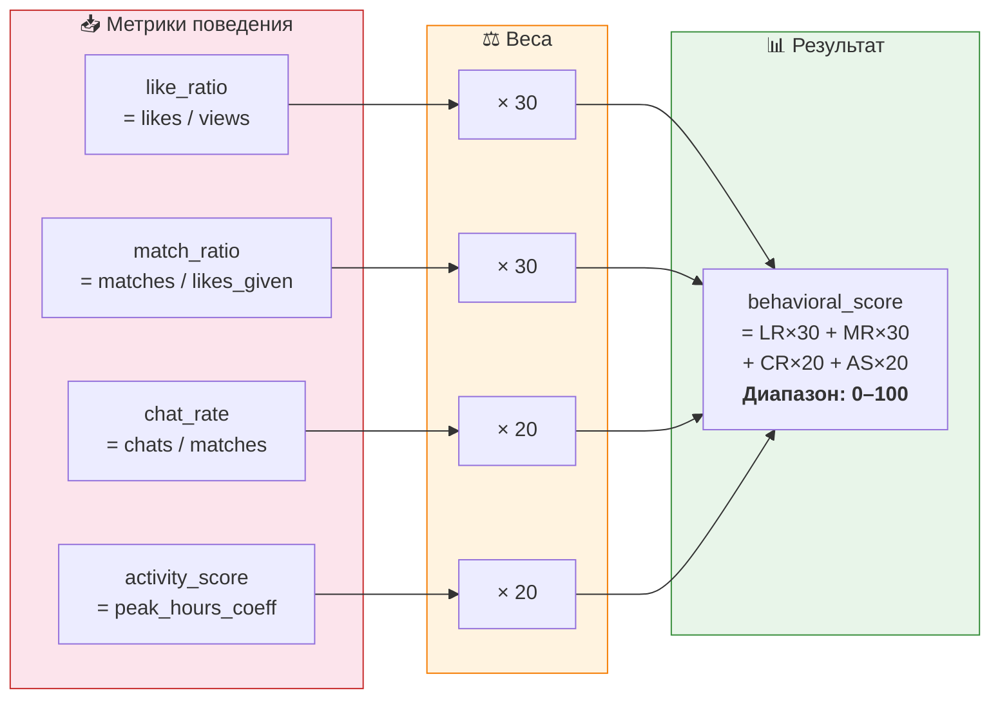
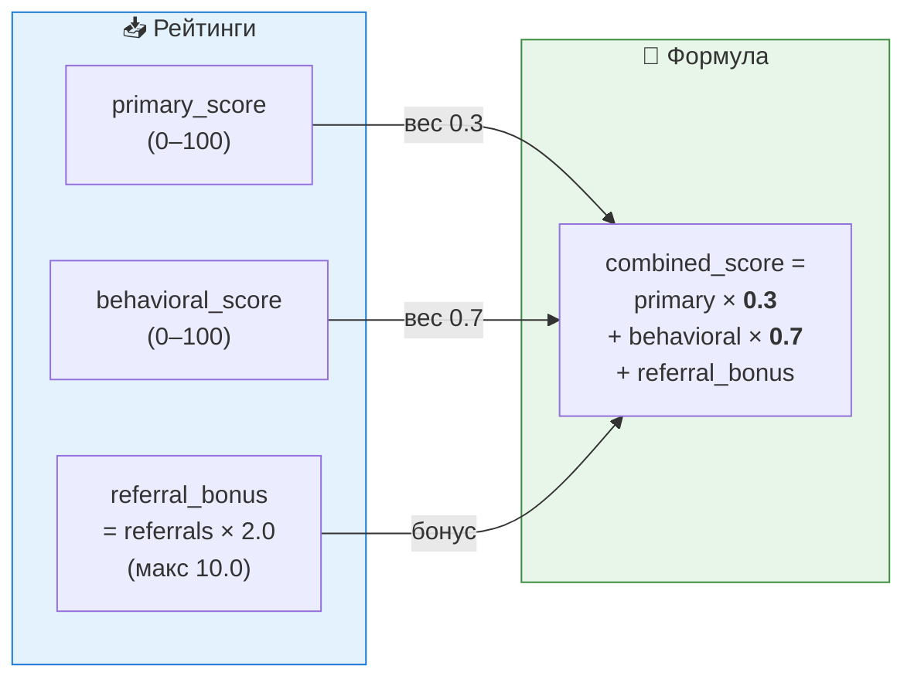
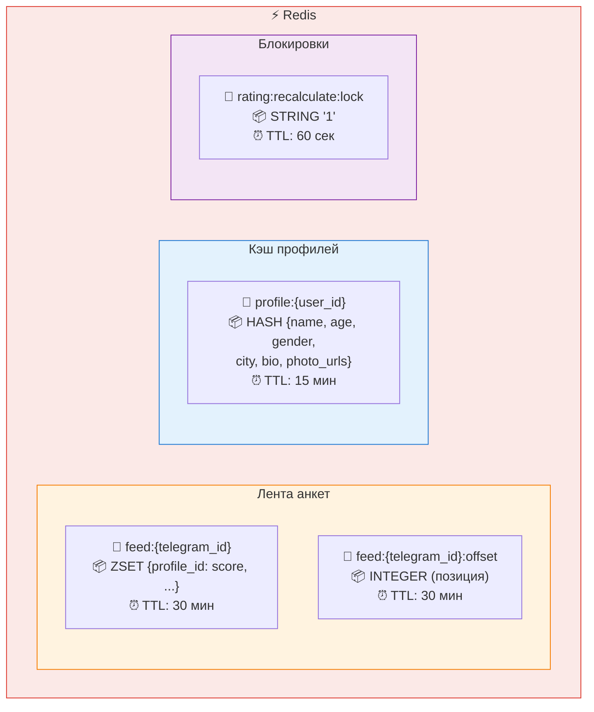

# Схема базы данных Dating Bot

## ER-диаграмма

---

## Подробное описание таблиц

### 1. `users` — Пользователи

> Базовая сущность. Создаётся при первом `/start` в Telegram.

| Поле | Тип | Ограничения | Описание |
|:-----|:----|:------------|:---------|
| `id` | `SERIAL` | `PRIMARY KEY` | Внутренний ID |
| `telegram_id` | `BIGINT` | `UNIQUE NOT NULL` | Telegram ID пользователя |
| `username` | `VARCHAR(255)` | `NULLABLE` | Telegram username |
| `referral_code` | `VARCHAR(32)` | `UNIQUE NOT NULL` | Уникальный реферальный код |
| `referred_by` | `INTEGER` | `FK → users(id), NULLABLE` | Кто пригласил |
| `is_active` | `BOOLEAN` | `DEFAULT TRUE` | Активен ли аккаунт |
| `created_at` | `TIMESTAMP` | `DEFAULT NOW()` | Дата регистрации |
| `updated_at` | `TIMESTAMP` | `DEFAULT NOW()` | Дата последнего обновления |
| `last_active` | `TIMESTAMP` | `DEFAULT NOW()` | Время последней активности |

📑 Индексы

| Имя | Поля | Тип | Назначение |
|:----|:-----|:----|:-----------|
| `idx_users_telegram_id` | `telegram_id` | UNIQUE | Основной поиск по Telegram ID |
| `idx_users_referral_code` | `referral_code` | UNIQUE | Поиск по реферальному коду |
| `idx_users_is_active` | `is_active` | B-tree | Фильтрация активных пользователей |

---

### 2. `profiles` — Анкеты

> Данные анкеты: имя, возраст, пол, город, описание, интересы. Связь 1:1 с `users`.

| Поле | Тип | Ограничения | Описание |
|:-----|:----|:------------|:---------|
| `id` | `SERIAL` | `PRIMARY KEY` | ID анкеты |
| `user_id` | `INTEGER` | `FK → users(id), UNIQUE NOT NULL` | Владелец (1:1) |
| `name` | `VARCHAR(100)` | `NOT NULL` | Имя |
| `age` | `SMALLINT` | `NOT NULL, CHECK(18..100)` | Возраст |
| `gender` | `VARCHAR(20)` | `NOT NULL` | Пол (`male` / `female` / `other`) |
| `city` | `VARCHAR(100)` | `NOT NULL` | Город |
| `bio` | `TEXT` | `NULLABLE` | О себе (до 500 символов) |
| `interests` | `TEXT[]` | `NULLABLE` | Массив интересов |
| `is_complete` | `BOOLEAN` | `DEFAULT FALSE` | Полностью ли заполнена анкета |
| `created_at` | `TIMESTAMP` | `DEFAULT NOW()` | Дата создания |
| `updated_at` | `TIMESTAMP` | `DEFAULT NOW()` | Дата обновления |

📑 Индексы

| Имя | Поля | Тип | Назначение |
|:----|:-----|:----|:-----------|
| `idx_profiles_user_id` | `user_id` | UNIQUE | Поиск анкеты по пользователю |
| `idx_profiles_gender` | `gender` | B-tree | Фильтрация по полу |
| `idx_profiles_city` | `city` | B-tree | Фильтрация по городу |
| `idx_profiles_age` | `age` | B-tree | Фильтрация по возрасту |
| `idx_profiles_filter` | `gender, city, age` | Composite | Основной фильтр ранжирования |

---

### 3. `photos` — Фотографии

> Фотографии анкеты. Файлы хранятся в MinIO (S3), в БД только ключи.

| Поле | Тип | Ограничения | Описание |
|:-----|:----|:------------|:---------|
| `id` | `SERIAL` | `PRIMARY KEY` | ID фото |
| `profile_id` | `INTEGER` | `FK → profiles(id), NOT NULL` | Анкета-владелец |
| `s3_key` | `VARCHAR(512)` | `NOT NULL` | Ключ объекта в S3 (MinIO) |
| `s3_bucket` | `VARCHAR(100)` | `NOT NULL, DEFAULT 'photos'` | Бакет в S3 |
| `is_primary` | `BOOLEAN` | `DEFAULT FALSE` | Главное фото (аватар) |
| `upload_order` | `SMALLINT` | `NOT NULL` | Порядок отображения |
| `created_at` | `TIMESTAMP` | `DEFAULT NOW()` | Дата загрузки |

> **Ограничения:** макс. 5 фотографий на анкету, ровно одно `is_primary = TRUE`

---

### 4. `preferences` — Предпочтения поиска

> Настройки фильтра: кого ищу по полу, возрасту, городу.

| Поле | Тип | Ограничения | Описание |
|:-----|:----|:------------|:---------|
| `id` | `SERIAL` | `PRIMARY KEY` | ID |
| `user_id` | `INTEGER` | `FK → users(id), UNIQUE NOT NULL` | Владелец (1:1) |
| `target_gender` | `VARCHAR(20)` | `NOT NULL` | Кого ищу (`male` / `female` / `any`) |
| `age_min` | `SMALLINT` | `DEFAULT 18, CHECK(≥ 18)` | Мин. возраст |
| `age_max` | `SMALLINT` | `DEFAULT 100, CHECK(≤ 100)` | Макс. возраст |
| `city` | `VARCHAR(100)` | `NULLABLE` | Город поиска (`NULL` = любой) |
| `max_distance` | `INTEGER` | `NULLABLE` | Макс. расстояние в км (на будущее) |
| `created_at` | `TIMESTAMP` | `DEFAULT NOW()` | Дата создания |
| `updated_at` | `TIMESTAMP` | `DEFAULT NOW()` | Дата обновления |

---

### 5. `swipes` — Свайпы (лайки / пропуски)

> Каждый свайп — одна запись. Уникальность на пару `(swiper, swiped)`.

| Поле | Тип | Ограничения | Описание |
|:-----|:----|:------------|:---------|
| `id` | `SERIAL` | `PRIMARY KEY` | ID свайпа |
| `swiper_id` | `INTEGER` | `FK → users(id), NOT NULL` | Кто свайпнул |
| `swiped_id` | `INTEGER` | `FK → users(id), NOT NULL` | Кого свайпнули |
| `action` | `VARCHAR(10)` | `NOT NULL, CHECK('like','skip')` | Действие |
| `created_at` | `TIMESTAMP` | `DEFAULT NOW()` | Время свайпа |

📑 Индексы

| Имя | Поля | Тип | Назначение |
|:----|:-----|:----|:-----------|
| `idx_swipes_pair` | `swiper_id, swiped_id` | UNIQUE | Один свайп на пару |
| `idx_swipes_swiped` | `swiped_id` | B-tree | Подсчёт лайков/пропусков |
| `idx_swipes_action` | `action` | B-tree | Фильтрация по типу |
| `idx_swipes_created` | `created_at` | B-tree | Временные запросы для рейтинга |

---

### 6. `matches` — Мэтчи (взаимные лайки)

> Создаётся при обнаружении взаимного лайка. `user1_id < user2_id` для уникальности.

| Поле | Тип | Ограничения | Описание |
|:-----|:----|:------------|:---------|
| `id` | `SERIAL` | `PRIMARY KEY` | ID мэтча |
| `user1_id` | `INTEGER` | `FK → users(id), NOT NULL` | Первый пользователь (меньший ID) |
| `user2_id` | `INTEGER` | `FK → users(id), NOT NULL` | Второй пользователь (больший ID) |
| `is_active` | `BOOLEAN` | `DEFAULT TRUE` | Активен ли мэтч |
| `chat_initiated` | `BOOLEAN` | `DEFAULT FALSE` | Начат ли диалог |
| `created_at` | `TIMESTAMP` | `DEFAULT NOW()` | Время мэтча |
| `updated_at` | `TIMESTAMP` | `DEFAULT NOW()` | Последнее обновление |

📑 Индексы

| Имя | Поля | Тип | Назначение |
|:----|:-----|:----|:-----------|
| `idx_matches_pair` | `user1_id, user2_id` | UNIQUE | Один мэтч на пару |
| `idx_matches_user1` | `user1_id` | B-tree | Поиск мэтчей пользователя |
| `idx_matches_user2` | `user2_id` | B-tree | Поиск мэтчей пользователя |

---

### 7. `ratings` — Рейтинги

> Отдельная таблица с рейтингами. Пересчитывается Celery-задачами.

| Поле | Тип | Ограничения | Описание |
|:-----|:----|:------------|:---------|
| `id` | `SERIAL` | `PRIMARY KEY` | ID записи |
| `user_id` | `INTEGER` | `FK → users(id), UNIQUE NOT NULL` | Пользователь |
| `primary_score` | `FLOAT` | `DEFAULT 0.0` | Первичный рейтинг (0–100) |
| `profile_completeness` | `FLOAT` | `DEFAULT 0.0` | Полнота анкеты (0–1) |
| `photo_count_score` | `FLOAT` | `DEFAULT 0.0` | Балл за кол-во фото (0–1) |
| `behavioral_score` | `FLOAT` | `DEFAULT 0.0` | Поведенческий рейтинг (0–100) |
| `likes_received` | `INTEGER` | `DEFAULT 0` | Всего лайков получено |
| `like_ratio` | `FLOAT` | `DEFAULT 0.0` | Лайки / показы (0–1) |
| `match_ratio` | `FLOAT` | `DEFAULT 0.0` | Мэтчи / лайки (0–1) |
| `chat_initiation_rate` | `FLOAT` | `DEFAULT 0.0` | Начатые диалоги / мэтчи (0–1) |
| `activity_score` | `FLOAT` | `DEFAULT 0.0` | Активность по времени суток (0–1) |
| `combined_score` | `FLOAT` | `DEFAULT 0.0` | **Итоговый комбинированный рейтинг** |
| `referral_bonus` | `FLOAT` | `DEFAULT 0.0` | Бонус за рефералов |
| `last_calculated_at` | `TIMESTAMP` | `NULLABLE` | Время последнего пересчёта |
| `created_at` | `TIMESTAMP` | `DEFAULT NOW()` | Дата создания |
| `updated_at` | `TIMESTAMP` | `DEFAULT NOW()` | Дата обновления |

📑 Индексы

| Имя | Поля | Тип | Назначение |
|:----|:-----|:----|:-----------|
| `idx_ratings_user` | `user_id` | UNIQUE | Один рейтинг на пользователя |
| `idx_ratings_score` | `combined_score DESC` | B-tree | Сортировка по рейтингу |
| `idx_ratings_stale` | `last_calculated_at` | B-tree | Выборка устаревших для пересчёта |

---

### 8. `referrals` — Реферальная система

> Отслеживание приглашений. Один пользователь может быть приглашён только один раз.

| Поле | Тип | Ограничения | Описание |
|:-----|:----|:------------|:---------|
| `id` | `SERIAL` | `PRIMARY KEY` | ID записи |
| `referrer_id` | `INTEGER` | `FK → users(id), NOT NULL` | Пригласивший |
| `referred_id` | `INTEGER` | `FK → users(id), UNIQUE NOT NULL` | Приглашённый |
| `bonus_applied` | `BOOLEAN` | `DEFAULT FALSE` | Бонус начислен |
| `created_at` | `TIMESTAMP` | `DEFAULT NOW()` | Время регистрации реферала |

---

## Формулы рейтинга

### Уровень 1 — Первичный рейтинг (`primary_score`)

### Уровень 2 — Поведенческий рейтинг (`behavioral_score`)

### Уровень 3 — Комбинированный рейтинг (`combined_score`)

---

## Структура Redis-кэша

