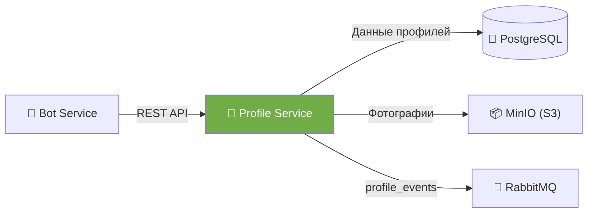
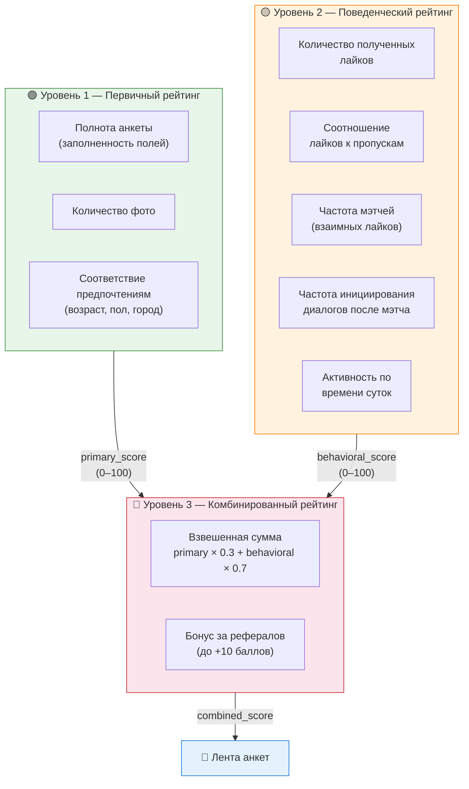
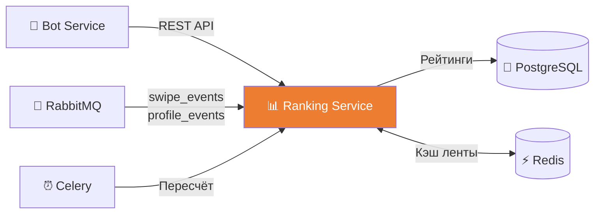
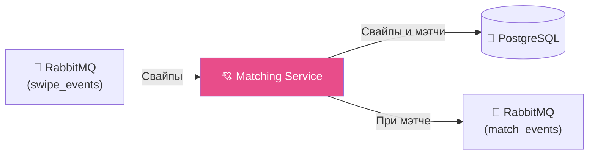
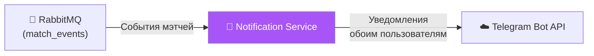
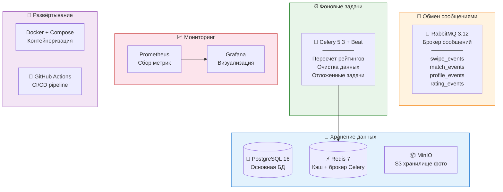

# Описание сервисов Dating Bot

## Обзор

Система построена на **микросервисной архитектуре**. Сервисы общаются между собой через брокер сообщений (RabbitMQ) и REST API. Каждый сервис выполняет свою чётко определённую задачу.

> **Сплошная линия** — синхронный REST API &nbsp;|&nbsp; **Пунктирная линия** — асинхронный обмен через RabbitMQ

---

## 1. 🤖 Telegram Bot Service (`bot-service`)

| | |
|:--|:--|
| **Назначение** | Интерфейс пользователя. Принимает команды из Telegram, отображает анкеты, обрабатывает свайпы, уведомляет о мэтчах |
| **Технологии** | Python, aiogram 3.x, aiohttp, aio-pika |
| **Порт** | — (общается с Telegram API напрямую) |

### Основные функции

- 🚀 Обработка команды `/start` — регистрация пользователя (Telegram ID)
- 📝 Заполнение анкеты через **пошаговый диалог (FSM)**:
  - Имя, возраст, пол, город, описание, интересы
  - Загрузка фотографий (1–5 штук)
  - Настройка предпочтений (кого ищу: пол, возрастной диапазон, город)
- 👀 Просмотр анкет — показ карточек других пользователей
- 💕 Свайп-механика — кнопки `❤️ Лайк` / `👎 Пропустить` / `⚙️ Настройки`
- 🔔 Получение уведомлений о мэтчах
- ✏️ Редактирование своей анкеты
- 🔗 Реферальная система — команда `/invite` генерирует ссылку

### Взаимодействие

---

## 2. 👤 Profile Service (`profile-service`)

| | |
|:--|:--|
| **Назначение** | Управление профилями пользователей. Хранение анкет, фотографий, предпочтений. CRUD-операции |
| **Технологии** | Python, FastAPI, SQLAlchemy, PostgreSQL, MinIO (S3), aio-pika |
| **Порт** | `8001` |

### Основные функции

- 📋 Регистрация пользователя по Telegram ID
- ✏️ Создание / обновление / получение / удаление анкеты
- 📷 Загрузка фотографий в S3-хранилище (MinIO)
- 🔗 Генерация presigned URL для доступа к фото
- ⚙️ Управление предпочтениями поиска
- 👥 Реферальная система — учёт приглашённых пользователей
- ✅ Валидация данных анкеты

### API эндпоинты

| Метод | Эндпоинт | Описание |
|:------|:---------|:---------|
| `POST` | `/api/v1/users/` | Регистрация нового пользователя |
| `GET` | `/api/v1/users/{telegram_id}` | Получение профиля |
| `PUT` | `/api/v1/users/{telegram_id}` | Обновление профиля |
| `DELETE` | `/api/v1/users/{telegram_id}` | Удаление профиля |
| `POST` | `/api/v1/users/{telegram_id}/photos` | Загрузка фото |
| `DELETE` | `/api/v1/users/{telegram_id}/photos/{photo_id}` | Удаление фото |
| `GET` | `/api/v1/users/{telegram_id}/preferences` | Получение предпочтений |
| `PUT` | `/api/v1/users/{telegram_id}/preferences` | Обновление предпочтений |
| `POST` | `/api/v1/users/{telegram_id}/referral` | Применение реферального кода |

### Взаимодействие

---

## 3. 📊 Ranking Service (`ranking-service`)

| | |
|:--|:--|
| **Назначение** | Расчёт и хранение рейтингов. Формирование персонализированной ленты анкет. Кэширование |
| **Технологии** | Python, FastAPI, SQLAlchemy, PostgreSQL, Redis, Celery, aio-pika |
| **Порт** | `8002` |

### Алгоритм рейтинга (3 уровня)

### Кэширование (Redis)

> При начале сессии просмотра: первая анкета проходит полный путь ранжирования.
> Одновременно подгружаются **10 следующих анкет** в Redis.
> Следующие 9 отдаются из кэша мгновенно.
> На **10-й анкете** — новый цикл подгрузки.

### Периодический пересчёт (Celery)

| Задача | Периодичность |
|:-------|:--------------|
| Пересчёт поведенческого рейтинга | Каждые **15 минут** |
| Очистка устаревших кэшей | Каждые **30 минут** |
| Полный пересчёт комбинированного рейтинга | Каждый **час** |

### API эндпоинты

| Метод | Эндпоинт | Описание |
|:------|:---------|:---------|
| `GET` | `/api/v1/feed/{telegram_id}` | Получить следующую анкету для показа |
| `GET` | `/api/v1/ratings/{telegram_id}` | Получить текущий рейтинг пользователя |
| `POST` | `/api/v1/ratings/recalculate` | Принудительный пересчёт (admin) |

### Взаимодействие

---

## 4. 💘 Matching Service (`matching-service`)

| | |
|:--|:--|
| **Назначение** | Обработка свайпов, определение мэтчей (взаимных лайков), ведение истории взаимодействий |
| **Технологии** | Python, FastAPI, SQLAlchemy, PostgreSQL, aio-pika |
| **Порт** | `8003` |

### Основные функции

- 📝 Запись свайпа (лайк / пропуск) в базу
- 💕 Проверка на взаимный лайк (мэтч)
- 📤 При мэтче — публикация события в очередь уведомлений
- 📖 Хранение истории просмотренных анкет (чтобы не показывать повторно)
- 📋 Предоставление списка мэтчей пользователя
- 📊 Публикация событий взаимодействия для Ranking Service

### API эндпоинты

| Метод | Эндпоинт | Описание |
|:------|:---------|:---------|
| `POST` | `/api/v1/swipes/` | Записать свайп (like/skip) |
| `GET` | `/api/v1/matches/{telegram_id}` | Список мэтчей пользователя |
| `GET` | `/api/v1/swipes/{telegram_id}/history` | История просмотренных анкет |

### Взаимодействие

---

## 5. 🔔 Notification Service (`notification-service`)

| | |
|:--|:--|
| **Назначение** | Отправка уведомлений пользователям. Обрабатывает события из очереди и формирует сообщения |
| **Технологии** | Python, aio-pika, aiohttp |
| **Порт** | — (только консюмер очереди) |

### Основные функции

- 📥 Подписка на очередь событий мэтчей из RabbitMQ
- 📝 Формирование текста уведомления
- 📤 Отправка уведомления **обоим** пользователям при мэтче через Telegram Bot API
- 📋 Логирование отправленных уведомлений
- 🔄 Retry-механизм при ошибках отправки

### Взаимодействие

---

## 🏗️ Инфраструктурные компоненты

| Компонент | Назначение |
|:----------|:-----------|
| **PostgreSQL** | Основная БД для всех сервисов |
| **Redis** | Кэш отранжированных очередей анкет, сессии просмотра, брокер Celery |
| **RabbitMQ** | Асинхронное взаимодействие между сервисами (loose coupling) |
| **Celery + Beat** | Периодический пересчёт рейтингов, очистка данных, отложенные задачи |
| **MinIO** | S3-совместимое хранилище фотографий, presigned URL |
| **Prometheus + Grafana** | Сбор и визуализация метрик (RPS, latency, errors, queue sizes) |
| **Docker Compose** | Контейнеризация всех сервисов, единый запуск |
| **GitHub Actions** | CI/CD: lint, тесты, сборка Docker-образов |
