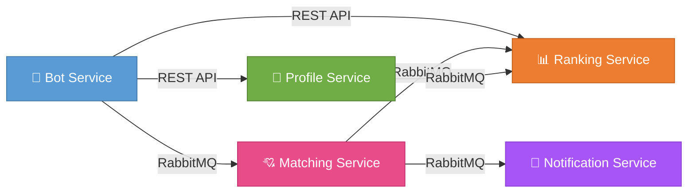
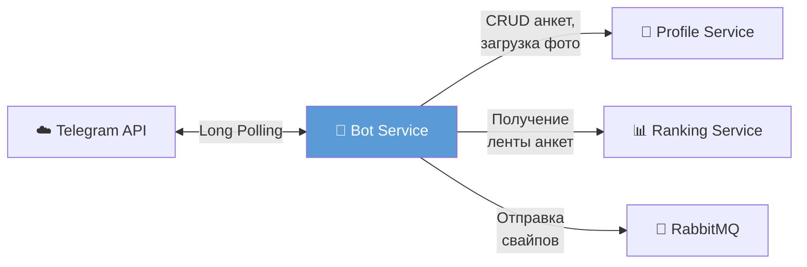
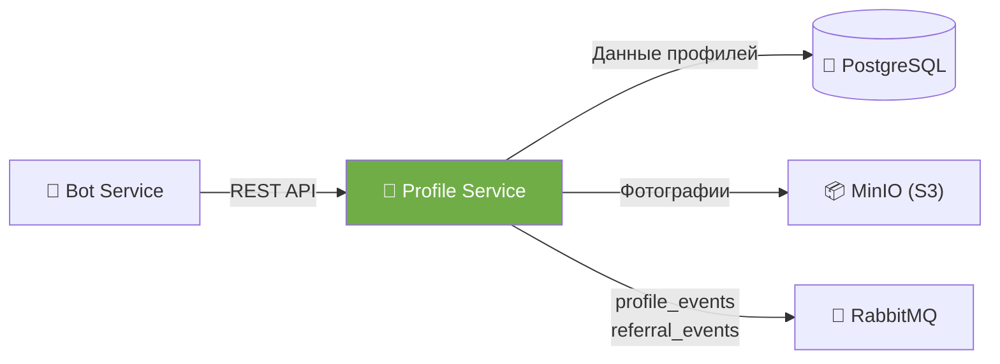
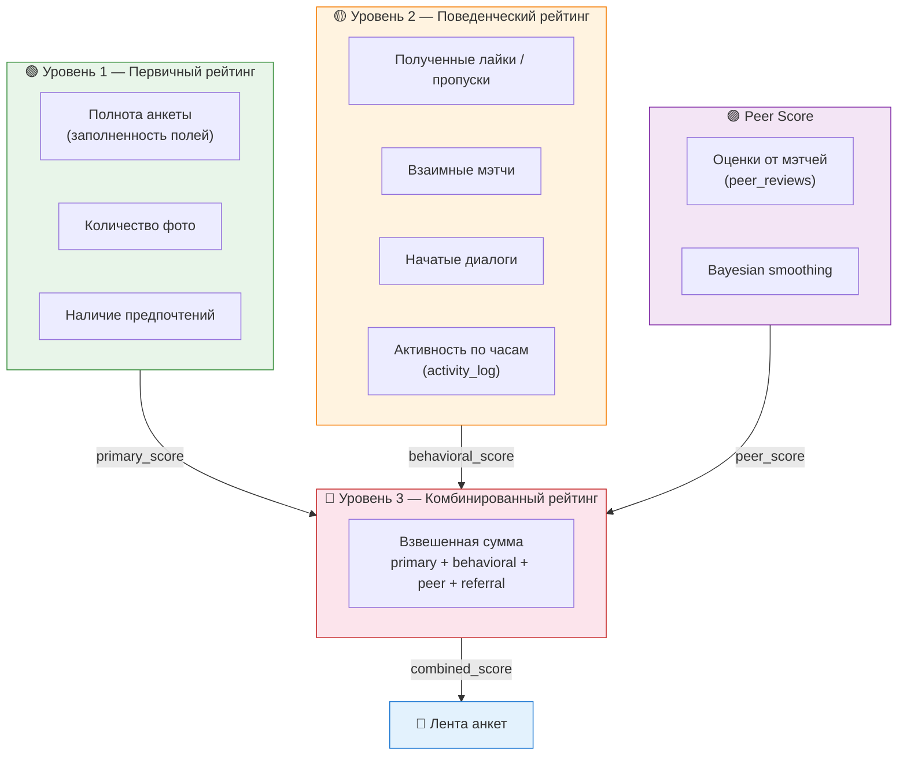
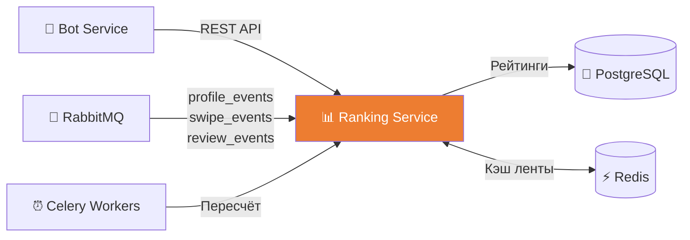
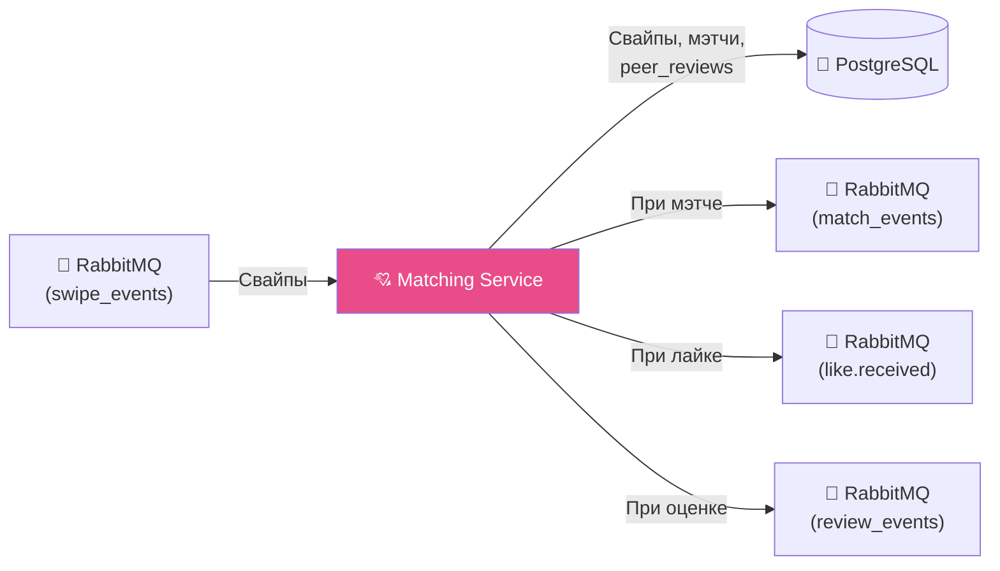
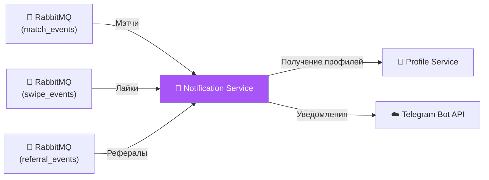
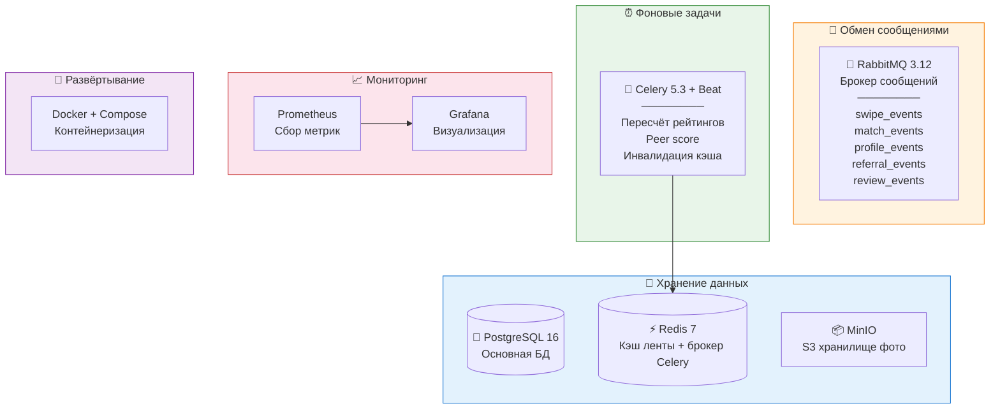

# Описание сервисов Dating Bot

## Обзор

Система построена на **микросервисной архитектуре**. Сервисы общаются между собой через брокер сообщений (RabbitMQ) и REST API. Каждый сервис выполняет свою чётко определённую задачу.

> **Сплошная линия** — синхронный REST API &nbsp;|&nbsp; **Пунктирная линия** — асинхронный обмен через RabbitMQ

---

## 1. 🤖 Telegram Bot Service (`bot-service`)

| | |
|:--|:--|
| **Назначение** | Интерфейс пользователя. Принимает команды из Telegram, отображает анкеты, обрабатывает свайпы, уведомляет о мэтчах, управляет фильтрами и оценками |
| **Технологии** | Python, aiogram 3.x, aiohttp, aio-pika, redis.asyncio |
| **Порт** | — (polling Telegram API) |

### Основные функции

- 🚀 Обработка `/start` — регистрация пользователя, deep-link реферальные коды (`?start=ref_...`)
- 🌐 **Многоязычность** (i18n) — переключение между `ru` и `en` через `/lang` или inline-кнопки
- 📝 Заполнение анкеты через **пошаговый диалог (FSM)**:
  - Имя, возраст, пол, город, описание, интересы
  - Загрузка фотографий (1–5 штук, поддержка media group / album middleware)
  - Настройка предпочтений: пол, возрастной диапазон, **город поиска** (`search_city` — свой / любой / произвольный)
- 👀 **Просмотр анкет** — показ карточек с фото-каруселью (media group), рейтингом и совместимостью
- 💕 **Свайп-механика** — кнопки `❤️ Лайк` / `👎 Пропустить` / `⏹️ Стоп`
- 💘 **Лента лайков** — просмотр пользователей, которые лайкнули тебя, с возможностью ответного свайпа
- ⭐ **Оценка мэтчей** (peer rating) — после мэтча можно оценить пользователя 1.0–5.0 (шаг 0.1)
- 🔗 Реферальная система — автоприменение реферального кода при регистрации
- ✏️ **Управление профилем** — просмотр своей анкеты с рейтингом, удаление аккаунта
- 🛡️ **Circuit Breaker** — защита от каскадных отказов при недоступности Profile / Ranking сервисов
- 📸 **Photo Proxy** — скачивание фото из MinIO и отправка в Telegram как `InputMediaPhoto` / `InputFile` для нативной карусели

### Взаимодействие

---

## 2. 👤 Profile Service (`profile-service`)

| | |
|:--|:--|
| **Назначение** | Управление профилями пользователей. Хранение анкет, фотографий, предпочтений. CRUD-операции. Публикация событий |
| **Технологии** | Python, FastAPI, SQLAlchemy 2.0, PostgreSQL, MinIO (S3), aio-pika |
| **Порт** | `8001` |

### Основные функции

- 📋 Регистрация пользователя по Telegram ID (идемпотентная — если пользователь уже есть, возвращает существующего)
- ✏️ Создание / обновление / получение / удаление анкеты
- 📷 Загрузка фотографий в S3-хранилище (MinIO), лимит 5 MB на файл
- 🔗 Генерация presigned URL для доступа к фото
- ⚙️ Управление предпочтениями поиска (включая `search_city`)
- 👥 Реферальная система — применение реферального кода (`/referrals/apply`)
- 🗑️ Каскадное удаление пользователя с очисткой фото из MinIO
- 📤 Публикация событий в RabbitMQ:
  - `profile_events` — при создании / обновлении / удалении профиля
  - `referral_events` — при успешном применении реферального кода

### API эндпоинты

| Метод | Эндпоинт | Описание |
|:------|:---------|:---------|
| `POST` | `/api/v1/users/` | Регистрация нового пользователя |
| `GET` | `/api/v1/users/{telegram_id}` | Полный профиль (user + profile + photos + preferences) |
| `PUT` | `/api/v1/users/{telegram_id}/profile` | Создание / обновление анкеты |
| `PUT` | `/api/v1/users/{telegram_id}/preferences` | Обновление предпочтений поиска |
| `POST` | `/api/v1/users/{telegram_id}/photos` | Загрузка фото (multipart/form-data) |
| `DELETE` | `/api/v1/users/{telegram_id}/photos/{photo_id}` | Удаление фото |
| `POST` | `/api/v1/referrals/apply` | Применение реферального кода |
| `DELETE` | `/api/v1/users/{telegram_id}` | Удаление пользователя и всех данных |
| `GET` | `/api/v1/health` | Health check |

### Взаимодействие

---

## 3. 📊 Ranking Service (`ranking-service`)

| | |
|:--|:--|
| **Назначение** | Расчёт рейтингов, формирование персонализированной ленты анкет, кэширование в Redis, Celery-задачи |
| **Технологии** | Python, FastAPI, SQLAlchemy, PostgreSQL, Redis, Celery, aio-pika |
| **Порт** | `8002` |

### Алгоритм рейтинга (3 уровня + peer)

### Формирование ленты (Feed)

- **Кэш:** Redis ZSET с JSON-сериализованными объектами профилей (`feed:{user_id}`)
- **Miss path:** SQL-запрос с фильтрами (`target_gender`, `age_min`/`age_max`, `search_city`) + исключением уже просмотренных
- **Сортировка:** по `peer_count` (количество оценок) + семантическому overlap интересов (`semantic_interest_boost`)
- **TTL:** 30 минут, размер батча: 10 профилей
- **Compatibility:** семантический буст на основе пересечения интересов (cosine similarity над embedding'ами)

### Периодический пересчёт (Celery)

| Задача | Периодичность | Назначение |
|:-------|:--------------|:-----------|
| `recalc_primary_for_user` | Реактивно (на `profile_events`) | Первичный рейтинг |
| `recalc_behavioral_all` | Каждые **15 минут** | Поведенческий рейтинг по окну 14 дней |
| `recalc_combined_all` | Каждый **час** | Комбинированный рейтинг + инвалидация кэша |
| `recalc_peer_all` | По расписанию | Пересчёт peer score для всех пользователей |
| `recalc_after_review_event` | На событие `review_events` | Мгновенный пересчёт peer score после новой оценки |

### API эндпоинты

| Метод | Эндпоинт | Описание |
|:------|:---------|:---------|
| `GET` | `/api/v1/feed/{telegram_id}?exclude_telegram_id=` | Следующая анкета для показа |
| `GET` | `/api/v1/ratings/{telegram_id}` | Текущий рейтинг пользователя (primary, behavioral, peer, referral, combined) |
| `GET` | `/api/v1/health` | Health check |

### Консьюмеры RabbitMQ

| Exchange | Routing Key | Действие |
|:---------|:------------|:---------|
| `profile_events` | `profile.updated` | Пересчёт primary score |
| `swipe_events` | `swipe.created` | Учёт свайпа в behavioral score |
| `review_events` | `review.created` / `review.updated` | Мгновенный пересчёт peer + combined score |

### Взаимодействие

---

## 4. 💘 Matching Service (`matching-service`)

| | |
|:--|:--|
| **Назначение** | Обработка свайпов, определение мэтчей, ведение истории, **peer reviews**, список полученных лайков |
| **Технологии** | Python, FastAPI, SQLAlchemy, PostgreSQL, aio-pika |
| **Порт** | `8003` |

### Основные функции

- 📝 Запись свайпа (лайк / пропуск) в базу. Идемпотентность через `UNIQUE(swiper_id, target_id)`
- 💕 Проверка на взаимный лайк (мэтч). При мэтче — публикация `match_events`
- 📤 При одностороннем лайке — публикация `like.received` для уведомления
- 📖 Хранение истории просмотренных анкет
- 📋 Предоставление списка мэтчей и **полученных лайков** (с рейтингом и peer-оценками)
- ⭐ **Peer Reviews** — создание / обновление оценки мэтча (1.0–5.0, шаг 0.1). Публикация `review_events`
- 📊 Сводка peer-оценок пользователя (`/reviews/{telegram_id}/summary`)

### API эндпоинты

| Метод | Эндпоинт | Описание |
|:------|:---------|:---------|
| `GET` | `/api/v1/matches/{telegram_id}` | Список мэтчей пользователя |
| `GET` | `/api/v1/swipes/{telegram_id}/history` | История просмотренных анкет |
| `GET` | `/api/v1/likes/{telegram_id}` | Пользователи, которые лайкнули тебя (с `combined_score`, `peer_avg`, `peer_count`) |
| `POST` | `/api/v1/reviews` | Создать / обновить оценку мэтча |
| `GET` | `/api/v1/reviews/{telegram_id}/summary` | Средняя оценка и количество peer reviews |
| `GET` | `/api/v1/health` | Health check |

### Правила peer reviews

- Оценивать можно **только мэтчей** (проверка `SELECT FROM matches`)
- Одна оценка на пару (`reviewer_id`, `reviewee_id`) — upsert
- Диапазон: 1.0 – 5.0, шаг 0.1
- Запрещена самооценка

### Консьюмер RabbitMQ

| Exchange | Queue | Routing Key | Действие |
|:---------|:------|:------------|:---------|
| `swipe_events` | `matching.swipe_events` | `swipe.created` | Запись свайпа, проверка mutual like |

### Публикации в RabbitMQ

| Exchange | Routing Key | Триггер |
|:---------|:------------|:--------|
| `match_events` | `match.created` | Взаимный лайк |
| `swipe_events` | `like.received` | Односторонний лайк |
| `review_events` | `review.created` / `review.updated` | Новая / изменённая оценка |

### Взаимодействие

---

## 5. 🔔 Notification Service (`notification-service`)

| | |
|:--|:--|
| **Назначение** | Отправка уведомлений пользователям через Telegram Bot API. Обрабатывает события из очереди |
| **Технологии** | Python, aio-pika, aiohttp |
| **Порт** | — (только консьюмеры очередей) |

### Основные функции

- 📥 Подписка на три типа событий:
  - **`match.created`** — уведомление обоим пользователям о мэтче
  - **`like.received`** — уведомление "Кому-то понравилась твоя анкета!"
  - **`referral.applied`** — уведомление пригласившему о новом реферале
- 💡 **Icebreaker** — при мэтче подбирает до 3 тем для разговора на основе общих интересов (шаблонный механизм, заменяемый на LLM в будущем)
- 👤 **Profile Client** — запрашивает профили обоих пользователей для формирования персонализированного сообщения
- 🔗 Добавляет `@username` в уведомление о мэтче для быстрого перехода в диалог
- 📊 Метрики: счётчики отправленных уведомлений по категориям

### Icebreaker — темы для разговора

Логика `pick_topics(interests_a, interests_b)`:
1. Находит пересечение интересов двух пользователей
2. Если есть общие интересы — выбирает случайную категорию и до 3 вопросов из шаблонов (`travel`, `music`, `sport`, `food`, `books`, `movies`, `games`, `art`, `tech`, `coffee`, `yoga`)
3. Если общих интересов нет — 3 случайных fallback-вопроса

### Консьюмеры RabbitMQ

| Exchange | Queue | Routing Key | Назначение |
|:---------|:------|:------------|:-----------|
| `match_events` | `notification.match_events` | `match.created` | Уведомление о мэтче + icebreaker |
| `swipe_events` | `notification.like_events` | `like.received` | Уведомление о лайке |
| `referral_events` | `notification.referral_events` | `referral.applied` | Уведомление о реферале |

### Взаимодействие

---

## 🏗️ Инфраструктурные компоненты

| Компонент | Назначение |
|:----------|:-----------|
| **PostgreSQL** | Основная БД для всех сервисов |
| **Redis** | Кэш отранжированных очередей анкет (ZSET), брокер Celery |
| **RabbitMQ** | Асинхронное взаимодействие между сервисами (loose coupling) |
| **Celery + Beat** | Периодический пересчёт рейтингов, peer score, инвалидация кэша |
| **MinIO** | S3-совместимое хранилище фотографий, presigned URL |
| **Prometheus + Grafana** | Сбор и визуализация метрик (RPS, latency, errors, queue sizes, icebreaker categories) |
| **Docker Compose** | Контейнеризация всех сервисов, единый запуск |

---

## 🔗 Общие библиотеки (`services/_shared`)

| Модуль | Назначение |
|:-------|:-----------|
| `circuit_breaker.py` | Circuit Breaker для защиты HTTP-клиентов от каскадных отказов |
| `events.py` | Канонические имена exchange / routing key (single source of truth) |
| `logging.py` | Структурированное JSON-логирование |
| `metrics.py` | Prometheus-метрики: счётчики регистраций, свайпов, мэтчей, уведомлений, времени ответа ленты |
| `rabbitmq.py` | Утилиты для публикации и потребления сообщений RabbitMQ |
| `settings.py` | Общие настройки окружения |
