# Пользовательские сценарии Dating Bot

> Документ описывает все возможные сценарии взаимодействия пользователя с ботом: от регистрации до удаления аккаунта. Каждый сценарий сопровождается sequence diagram, пошаговым описанием и альтернативными ветками.

---

## Общая карта сценариев

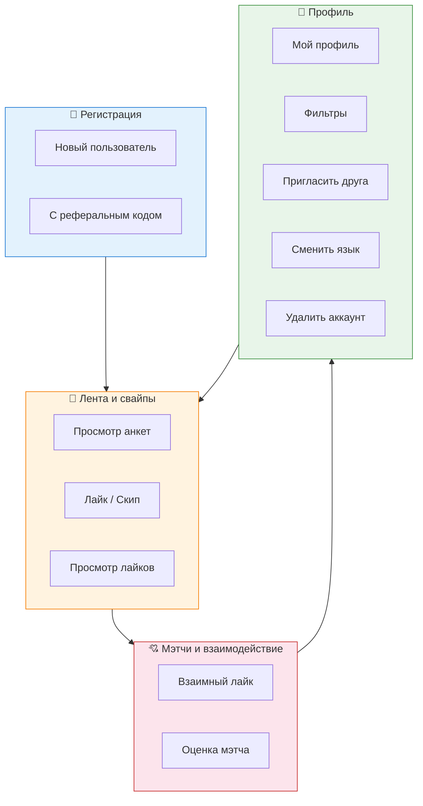

---

## Основные сценарии (Happy Path)

---

### Сценарий 1. Регистрация нового пользователя

**Акторы:** Пользователь, Bot Service, Profile Service, PostgreSQL, MinIO  
**Предусловия:** Пользователь открыл бот впервые, токен бота валиден  
**Постусловия:** Пользователь создан в БД, анкета заполнена, главное меню отображается

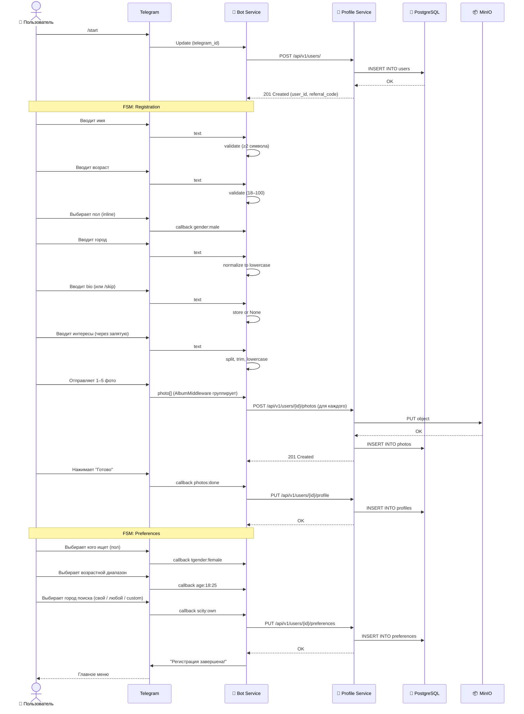

**Пошаговое описание:**
1. Пользователь отправляет `/start`.
2. Бот создаёт пользователя в Profile Service (генерируется `referral_code`).
3. Бот переводит пользователя в FSM `Registration.name`.
4. Пошаговый ввод: имя → возраст → пол (inline кнопки) → город → bio (опционально, `/skip`) → интересы (опционально, `/skip`).
5. Загрузка фото: 1–5 штук. Поддерживается отправка нескольких фото сразу (media group через `AlbumMiddleware`). Бот обновляет счётчик в inline-клавиатуре.
6. Нажатие "Готово" — бот отправляет анкету в Profile Service.
7. Настройка предпочтений: пол, возраст, город поиска (`search_city`).
8. Бот показывает главное меню.

**Альтернативные ветки:**
- **Пользователь уже существует** → см. Сценарий A1.
- **Невалидный возраст** → бот просит ввести число 18–100.
- **Фото >5 шт.** → бот принимает первые 5, сообщает сколько проигнорировано.
- **Не нажал "Готово"** → анкета не сохраняется, при повторном `/start` предлагает продолжить.

**Задействованные файлы:**
- `services/bot-service/app/handlers/registration.py`
- `services/bot-service/app/fsm.py` — `Registration`
- `services/bot-service/app/middlewares.py` — `AlbumMiddleware`
- `services/bot-service/app/keyboards.py` — `gender_kb`, `age_preset_kb`, `photos_done_kb`, `search_city_kb`, `target_gender_kb`
- `services/profile-service/app/routes.py` — `create_user`, `upsert_profile`, `upload_photo`, `upsert_preferences`
- `services/profile-service/app/models.py` — `User`, `Profile`, `Photo`, `Preferences`

---

### Сценарий 2. Регистрация с реферальным кодом

**Акторы:** Пользователь (приглашённый), Bot Service, Profile Service  
**Предусловия:** Пользователь перешёл по реферальной ссылке (`?start=ref_ABC123`)  
**Постусловия:** Пользователь зарегистрирован, реферал применён, пригласивший получит уведомление

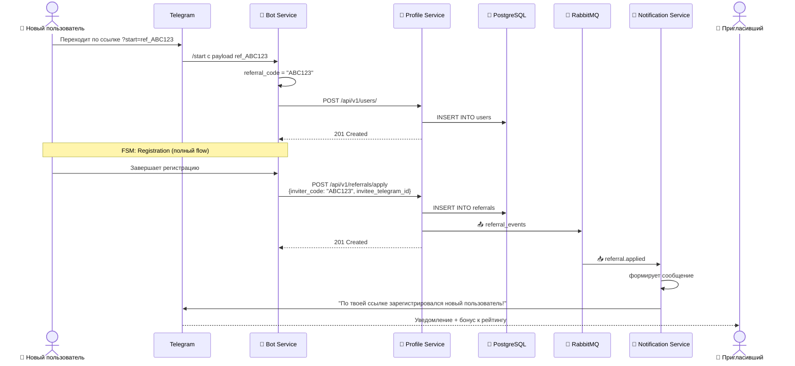

**Пошаговое описание:**
1. Пользователь открывает бот по реферальной ссылке (`https://t.me/BotName?start=ref_ABC123`).
2. Бот извлекает код `ref_` из `command.args`.
3. Проходит обычная регистрация (Сценарий 1).
4. После завершения регистрации бот вызывает `POST /api/v1/referrals/apply`.
5. Profile Service создаёт запись в `referrals`, публикует событие в RabbitMQ.
6. Notification Service отправляет пригласившему уведомление с указанием бонуса.

**Альтернативные ветки:**
- **Невалидный код** → Profile Service возвращает 404, бот продолжает регистрацию без реферала.
- **Самоприглашение** → Profile Service возвращает 400, бот игнорирует.
- **Пользователь уже был приглашён** → Profile Service возвращает 409 (уникальность `invitee_id`).

**Задействованные файлы:**
- `services/bot-service/app/handlers/registration.py` — `start_with_payload()`, `_complete_registration()`
- `services/profile-service/app/routes.py` — `apply_referral()`
- `services/profile-service/app/events_publisher.py` — `emit_referral_applied()`
- `services/notification-service/app/consumer.py` — `handle_referral_event()`

---

### Сценарий 3. Просмотр ленты анкет

**Акторы:** Пользователь, Bot Service, Ranking Service, Profile Service, Redis, PostgreSQL  
**Предусловия:** Пользователь зарегистрирован, анкета заполнена  
**Постусловия:** Пользователь видит карточку кандидата с фото, рейтингом и совместимостью

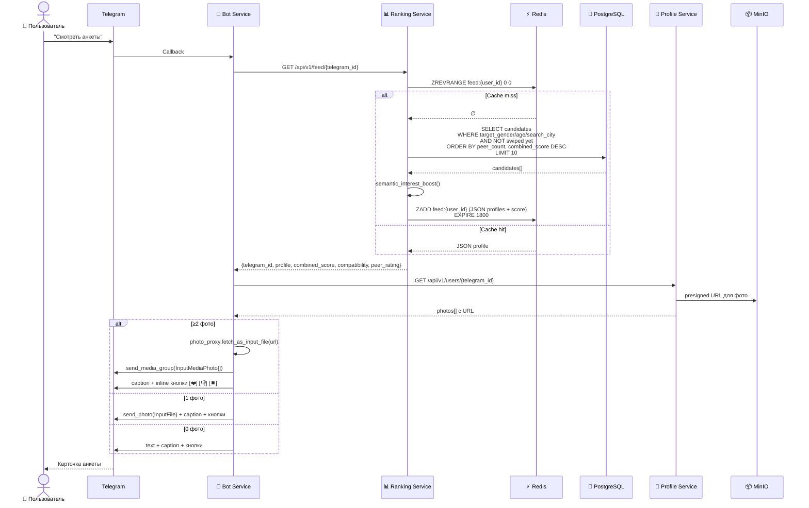

**Пошаговое описание:**
1. Пользователь нажимает "Смотреть анкеты" в главном меню.
2. Bot Service запрашивает ленту у Ranking Service.
3. Ranking Service проверяет Redis (`feed:{user_id}`):
   - **Miss** → делает SQL-запрос с фильтрами (`target_gender`, `age_min/max`, `search_city`), исключает уже просмотренные анкеты. Сортирует по `peer_count` + semantic interest boost. Кладёт топ-10 в ZSET.
   - **Hit** → достаёт JSON из вершины ZSET.
4. Bot Service запрашивает полный профиль (фото) у Profile Service.
5. Если у кандидата несколько фото — бот скачивает их через `photo_proxy` и отправляет как media group (карусель).
6. Под карточкой отображаются кнопки: ❤️ Лайк, 👎 Пропустить, ⏹️ Стоп.

**Альтернативные ветки:**
- **Лента пуста** → см. Сценарий A2.
- **Ranking Service недоступен** → см. Сценарий A3.

**Задействованные файлы:**
- `services/bot-service/app/handlers/menu.py` — `show_feed()`, `_render_card()`
- `services/bot-service/app/photo_proxy.py` — `fetch_as_input_file()`
- `services/ranking-service/app/feed_service.py` — `get_next_candidate()`
- `services/ranking-service/app/embeddings.py` — `semantic_interest_boost()`
- `services/profile-service/app/routes.py` — `get_user()`

---

### Сценарий 4. Лайк / пропуск анкеты

**Акторы:** Пользователь, Bot Service, RabbitMQ, Matching Service (async)  
**Предусловия:** Пользователь видит карточку анкеты  
**Постусловия:** Свайп записан в БД, показана следующая анкета

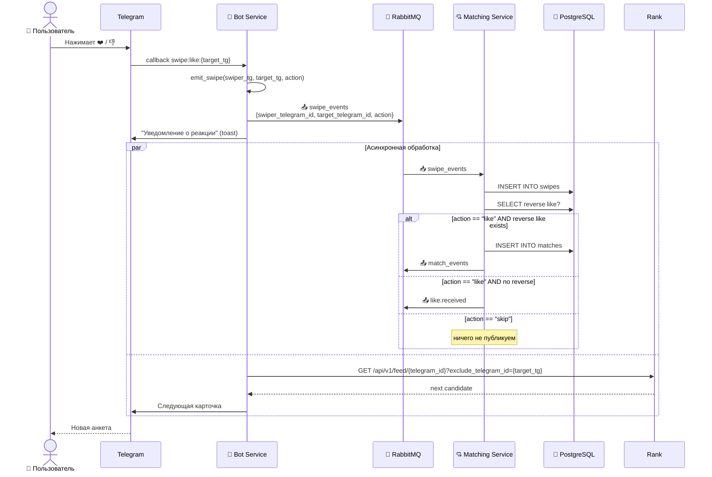

**Пошаговое описание:**
1. Пользователь нажимает ❤️ или 👎.
2. Bot Service публикует событие в `swipe_events` через RabbitMQ.
3. Пользователю показывается toast-подтверждение ("❤️" или "👎").
4. **Параллельно:**
   - Bot запрашивает следующую анкету с `exclude_telegram_id` (чтобы избежать race condition).
   - Matching Service (асинхронно) записывает свайп в БД и проверяет взаимный лайк.
5. Следующая карточка отображается пользователю.

**Альтернативные ветки:**
- **Повторный свайп** → Matching Service ловит `IntegrityError`, игнорирует дубликат (идемпотентность). См. Сценарий A6.
- **Нажал "Стоп"** → бот выходит из ленты, показывает главное меню.

**Задействованные файлы:**
- `services/bot-service/app/handlers/menu.py` — `on_swipe()`
- `services/bot-service/app/swipe_publisher.py` — `emit_swipe()`
- `services/matching-service/app/consumer.py` — `handle_swipe_event()`
- `services/matching-service/app/models.py` — `Swipe`

---

### Сценарий 5. Взаимный лайк (мэтч)

**Акторы:** Пользователь А, Пользователь Б, Matching Service, Notification Service, Profile Service  
**Предусловия:** А лайкнул Б ранее; Б сейчас лайкает А  
**Постусловия:** Мэтч создан в БД, оба пользователя получают уведомление с icebreaker

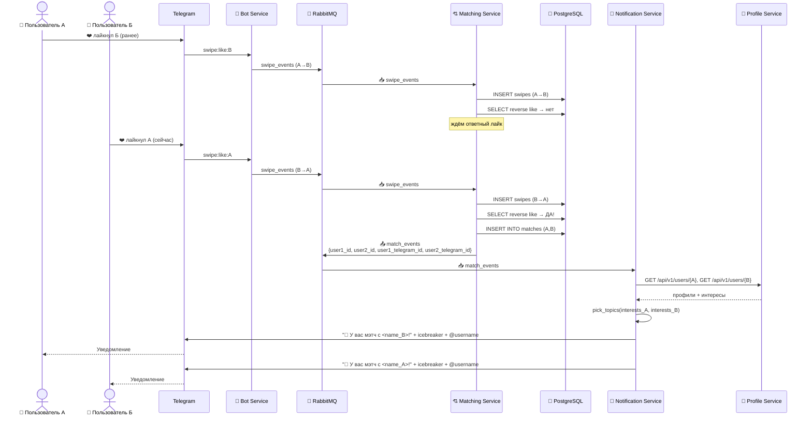

**Пошаговое описание:**
1. Пользователь А лайкает Б (односторонний свайп записан).
2. Пользователь Б лайкает А.
3. Matching Service находит обратный лайк в БД.
4. Создаётся запись в `matches` (`user1_id < user2_id` для уникальности).
5. Публикуется событие `match_events`.
6. Notification Service:
   - Запрашивает профили обоих пользователей.
   - Находит общие интересы, выбирает 3 icebreaker-вопроса.
   - Отправляет персонализированное уведомление каждому с `@username` для быстрого перехода в диалог.

**Альтернативные ветки:**
- **Мэтч уже существует** → `IntegrityError` на `uq_match_pair`, игнорируется.
- **У одного из пользователей нет username** → уведомление без ссылки `@username`.

**Задействованные файлы:**
- `services/matching-service/app/consumer.py` — `handle_swipe_event()`
- `services/notification-service/app/consumer.py` — `handle_match_event()`
- `services/notification-service/app/icebreaker.py` — `pick_topics()`
- `services/notification-service/app/profile_client.py` — `get_user()`

---

### Сценарий 6. Просмотр полученных лайков

**Акторы:** Пользователь, Bot Service, Matching Service, Profile Service  
**Предусловия:** Другие пользователи лайкнули текущего пользователя  
**Постусловия:** Пользователь видит ленту тех, кто его лайкнул, может ответить лайком или пропустить

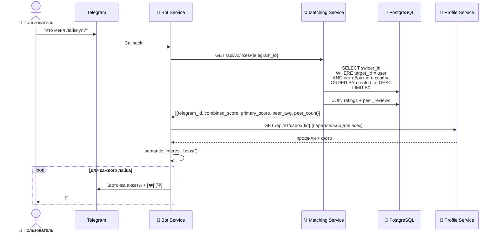

**Пошаговое описание:**
1. Пользователь нажимает "Кто меня лайкнул?".
2. Bot Service запрашивает список лайков у Matching Service.
3. Matching Service находит всех, кто лайкнул пользователя, но не получил ответного свайпа. JOIN'ит `ratings` и агрегат `peer_reviews` для enriched данных.
4. Bot Service параллельно запрашивает профили (`asyncio.gather`).
5. Для каждого кандидата вычисляется semantic compatibility.
6. Карточки показываются последовательно с кнопками ❤️ / 👎 (аналогично обычной ленте).

**Альтернативные ветки:**
- **Лайков нет** → бот сообщает "Пока никто тебя не лайкнул" и показывает главное меню.
- **Профиль кандидата удалён** → бот пропускает его и показывает следующего.

**Задействованные файлы:**
- `services/bot-service/app/handlers/menu.py` — `show_likes()`, `_show_next_like()`
- `services/bot-service/app/fsm.py` — `LikesFeed.viewing`
- `services/matching-service/app/routes.py` — `list_likes()`

---

### Сценарий 7. Оценка мэтча (Peer Review)

**Акторы:** Пользователь, Bot Service, Matching Service, Ranking Service  
**Предусловия:** У пользователя есть хотя бы один мэтч  
**Постусловия:** Оценка сохранена, peer_score пересчитан, рейтинг обновлён

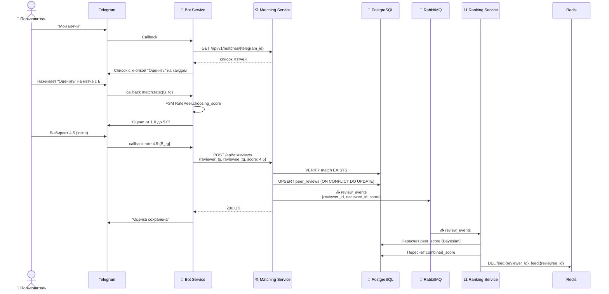

**Пошаговое описание:**
1. Пользователь открывает "Мои мэтчи".
2. Бот показывает список мэтчей с кнопкой "Оценить".
3. Пользователь нажимает "Оценить" — бот переводит в FSM `RatePeer.choosing_score`.
4. Пользователь выбирает оценку (inline кнопки 1.0–5.0 с шагом 0.5 или вводит текстом).
5. Bot Service отправляет оценку в Matching Service.
6. Matching Service проверяет, что мэтч существует, и выполняет upsert в `peer_reviews`.
7. Публикуется событие `review_events`.
8. Ranking Service пересчитывает `peer_score` и `combined_score` для обоих пользователей, инвалидирует кэш ленты.

**Альтернативные ветки:**
- **Нет мэтчей** → бот сообщает "У тебя пока нет мэтчей".
- **Попытка оценить без мэтча** → Matching Service возвращает 403. См. Сценарий A7.
- **Оценка вне диапазона** → Matching Service валидирует (1.0–5.0, шаг 0.1), возвращает 422.
- **Отмена оценки** → кнопка "Отмена", FSM сбрасывается.

**Задействованные файлы:**
- `services/bot-service/app/handlers/menu.py` — `my_matches()`, `on_rate_match()`, `on_rate_score()`
- `services/bot-service/app/fsm.py` — `RatePeer`
- `services/bot-service/app/keyboards.py` — `match_actions_kb()`, `rate_peer_kb()`
- `services/matching-service/app/routes.py` — `create_or_update_review()`
- `services/ranking-service/app/tasks.py` — `recalc_after_review_event()`

---

### Сценарий 8. Управление профилем

**Акторы:** Пользователь, Bot Service, Profile Service  
**Предусловия:** Пользователь зарегистрирован  
**Постусловия:** Пользователь видит свою анкету с текущим рейтингом

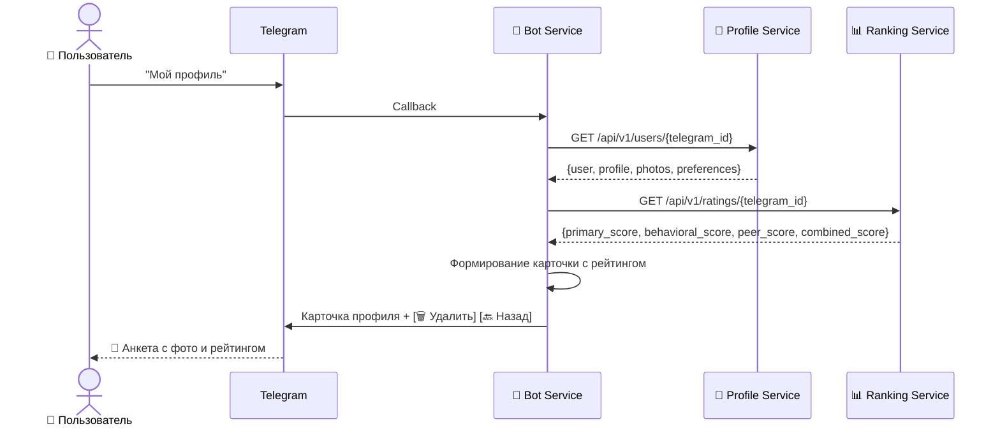

**Пошаговое описание:**
1. Пользователь нажимает "Мой профиль".
2. Bot Service запрашивает полный профиль у Profile Service.
3. Параллельно запрашивает рейтинг у Ranking Service.
4. Формируется карточка: имя, возраст, город, рейтинг (combined или primary fallback), интересы, bio, фото (media group если ≥2).
5. Отображаются кнопки: "Удалить профиль", "Назад".

**Задействованные файлы:**
- `services/bot-service/app/handlers/menu.py` — `my_profile()`
- `services/profile-service/app/routes.py` — `get_user()`
- `services/ranking-service/app/routes.py` — `ratings()`

---

### Сценарий 9. Изменение фильтров поиска

**Акторы:** Пользователь, Bot Service, Profile Service, Ranking Service  
**Предусловия:** Пользователь зарегистрирован  
**Постусловия:** Фильтры обновлены, кэш ленты инвалидирован

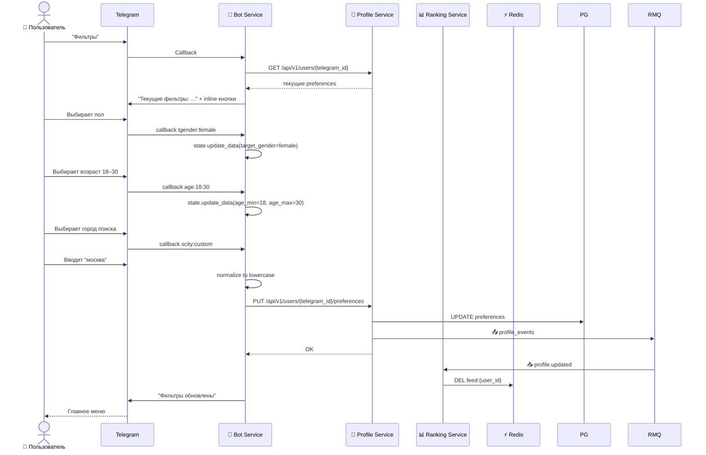

**Пошаговое описание:**
1. Пользователь нажимает "Фильтры".
2. Бот показывает текущие настройки и inline-кнопки для изменения.
3. Пошаговый выбор: пол → возраст (preset или custom) → город поиска (свой / любой / custom).
4. Бот отправляет обновлённые preferences в Profile Service.
5. Profile Service публикует `profile_events`.
6. Ranking Service инвалидирует кэш ленты (`DEL feed:{user_id}`).

**Альтернативные ветки:**
- **Возраст min > max** → бот сообщает об ошибке, просит повторить.
- **Город не указан** → `search_city = NULL` (поиск по всем городам).

**Задействованные файлы:**
- `services/bot-service/app/handlers/menu.py` — `filters_entry()`, `filters_target()`, `filters_age_preset()`, `filters_search_city()`
- `services/bot-service/app/fsm.py` — `Filters`
- `services/profile-service/app/routes.py` — `upsert_preferences()`
- `services/ranking-service/app/consumers.py` — `handle_profile_updated()` (инвалидация кэша)

---

### Сценарий 10. Приглашение друга (реферальная система)

**Акторы:** Пользователь, Bot Service  
**Предусловия:** Пользователь зарегистрирован  
**Постусловия:** Пользователь получает реферальную ссылку

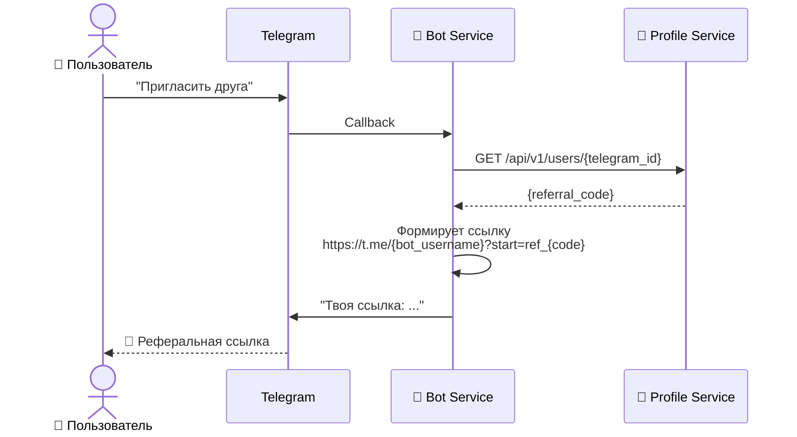

**Пошаговое описание:**
1. Пользователь нажимает "Пригласить друга".
2. Bot Service запрашивает профиль для получения `referral_code`.
3. Формируется deep-link: `https://t.me/{bot_username}?start=ref_{code}`.
4. Бот отправляет сообщение с ссылкой и кодом.

**Задействованные файлы:**
- `services/bot-service/app/handlers/menu.py` — `invite_friend()`

---

### Сценарий 11. Смена языка

**Акторы:** Пользователь, Bot Service  
**Предусловия:** Пользователь зарегистрирован  
**Постусловия:** Интерфейс бота переключён на выбранный язык

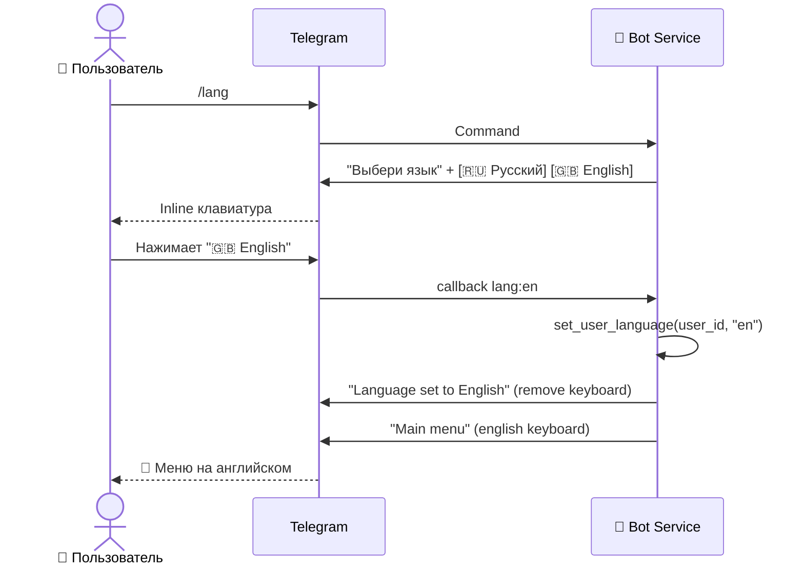

**Пошаговое описание:**
1. Пользователь отправляет `/lang`.
2. Бот показывает inline-кнопки с языками.
3. Пользователь выбирает язык.
4. Бот сохраняет выбор в middleware-контексте.
5. Все последующие сообщения и клавиатуры генерируются на выбранном языке.

**Альтернативные ветки:**
- **Смена языка во время FSM** → middleware подхватывает новый язык, FSM-состояние не сбрасывается.

**Задействованные файлы:**
- `services/bot-service/app/handlers/registration.py` — `cmd_lang()`, `callback_set_lang()`
- `services/bot-service/app/i18n_middleware.py` — `set_user_language()`
- `services/bot-service/app/i18n.py` — `I18n`
- `services/bot-service/locales/ru.json`, `locales/en.json`

---

### Сценарий 12. Удаление аккаунта

**Акторы:** Пользователь, Bot Service, Profile Service, MinIO  
**Предусловия:** Пользователь зарегистрирован  
**Постусловия:** Пользователь и все данные удалены из системы

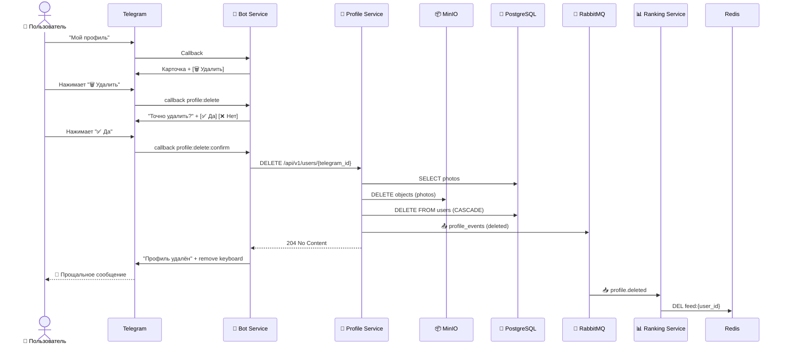

**Пошаговое описание:**
1. Пользователь открывает "Мой профиль".
2. Нажимает "Удалить".
3. Бот запрашивает подтверждение.
4. При подтверждении — вызывает `DELETE /api/v1/users/{telegram_id}`.
5. Profile Service:
   - Загружает список фото.
   - Удаляет объекты из MinIO.
   - Удаляет пользователя из БД (CASCADE удаляет profile, photos, preferences, ratings).
   - Публикует `profile_events` (deleted).
6. Ranking Service инвалидирует кэш.
7. Бот удаляет клавиатуру и прощается.

**Альтернативные ветки:**
- **Нажал "Нет"** → клавиатура удаляется, бот возвращается в профиль.
- **Пользователь не найден** → Profile Service возвращает 404.

**Задействованные файлы:**
- `services/bot-service/app/handlers/menu.py` — `on_delete_profile()`, `on_delete_profile_confirm()`, `on_delete_profile_cancel()`
- `services/profile-service/app/routes.py` — `delete_user()`
- `services/ranking-service/app/consumers.py` — `handle_profile_deleted()`

---

## Альтернативные и негативные сценарии

---

### Сценарий A1. Повторный `/start` для существующего пользователя

**Описание:** Пользователь уже зарегистрирован, но снова отправляет `/start`.

**Flow:**
1. Bot Service находит пользователя в Profile Service (`GET /api/v1/users/{telegram_id}`).
2. Если анкета заполнена — бот приветствует и показывает главное меню (`start_welcome_back`).
3. Если анкета не заполнена (прервал регистрацию) — предлагает продолжить (`start_resume_registration`), переводит в FSM `Registration.name`.
4. Если при повторном `/start` передан реферальный код и пользователь ещё не был приглашён — бот пытается применить код.

**Задействованные файлы:**
- `services/bot-service/app/handlers/registration.py` — `_begin_or_resume()`

---

### Сценарий A2. Пустая лента (нет кандидатов)

**Описание:** Для пользователя нет подходящих анкет по фильтрам.

**Flow:**
1. Ranking Service возвращает `{"profile": null}`.
2. Bot Service показывает сообщение: "Анкеты закончились, попробуй изменить фильтры".
3. Предлагает кнопку "Изменить фильтры".

**Задействованные файлы:**
- `services/bot-service/app/handlers/menu.py` — `show_feed()`
- `services/ranking-service/app/feed_service.py` — `get_next_candidate()` (returns `None`)

---

### Сценарий A3. Сервис недоступен (Circuit Breaker)

**Описание:** Profile Service или Ranking Service временно недоступен.

**Flow:**
1. Bot Service делает HTTP-запрос через `api_client`.
2. Circuit Breaker в состоянии OPEN — мгновенно возвращает `CircuitOpenApiError`.
3. Bot Service показывает fallback-сообщение на языке пользователя (`error_feed_service_unavailable`, `error_profile_service_unavailable`).
4. Пользователь не зависает в ожидании таймаута.

**Задействованные файлы:**
- `services/_shared/circuit_breaker.py`
- `services/bot-service/app/api_client.py`
- `services/bot-service/app/handlers/menu.py`

---

### Сценарий A4. Загрузка более 5 фото

**Описание:** Пользователь отправляет 7 фото за раз.

**Flow:**
1. `AlbumMiddleware` группирует все фото в один список.
2. Bot Service считает: `free = max(0, 5 - len(existing_photos))`.
3. Принимаются первые `free` фото, остальные игнорируются.
4. Бот сообщает: "Принято X фото, Y проигнорировано (макс. 5)".
5. Счётчик в inline-клавиатуре обновляется через `edit_message_reply_markup`.

**Задействованные файлы:**
- `services/bot-service/app/handlers/registration.py` — `reg_photo()`
- `services/bot-service/app/middlewares.py` — `AlbumMiddleware`

---

### Сценарий A5. Невалидный реферальный код

**Описание:** Пользователь ввёл несуществующий реферальный код.

**Flow:**
1. Bot Service вызывает `POST /api/v1/referrals/apply`.
2. Profile Service не находит пользователя по коду → 404.
3. Bot Service логирует ошибку, но **не прерывает** регистрацию.
4. Пользователь завершает регистрацию без реферала.

**Задействованные файлы:**
- `services/profile-service/app/routes.py` — `apply_referral()`

---

### Сценарий A6. Повторный лайк (идемпотентность)

**Описание:** Пользователь случайно лайкает ту же анкету дважды.

**Flow:**
1. Matching Service получает второе событие `swipe_events`.
2. Пытается `INSERT INTO swipes`.
3. `IntegrityError` на `uq_swipe_pair` → транзакция откатывается.
4. Matching Service логирует `swipe_duplicate` и молча завершает обработку.
5. Пользователю не показывается ошибка (обработка асинхронная).

**Задействованные файлы:**
- `services/matching-service/app/consumer.py` — `handle_swipe_event()`

---

### Сценарий A7. Peer review без мэтча

**Описание:** Пользователь пытается оценить кого-то, с кем нет мэтча.

**Flow:**
1. Bot Service отправляет `POST /api/v1/reviews`.
2. Matching Service проверяет `SELECT FROM matches WHERE user1_id = min(a,b) AND user2_id = max(a,b)`.
3. Результат `None` → возвращает HTTP 403 с текстом "can only review users you have matched with".
4. Bot Service показывает пользователю сообщение об ошибке.

**Задействованные файлы:**
- `services/matching-service/app/routes.py` — `create_or_update_review()`

---

### Сценарий A8. Самооценка (review себя)

**Описание:** Пользователь каким-то образом пытается оценить сам себя.

**Flow:**
1. Matching Service сравнивает `reviewer_id` и `reviewee_id`.
2. Если равны → HTTP 400 "cannot review yourself".
3. Также есть CHECK-ограничение в БД: `ck_peer_review_no_self`.

**Задействованные файлы:**
- `services/matching-service/app/routes.py` — `create_or_update_review()`
- `services/matching-service/app/models.py` — `PeerReview` (`ck_peer_review_no_self`)
