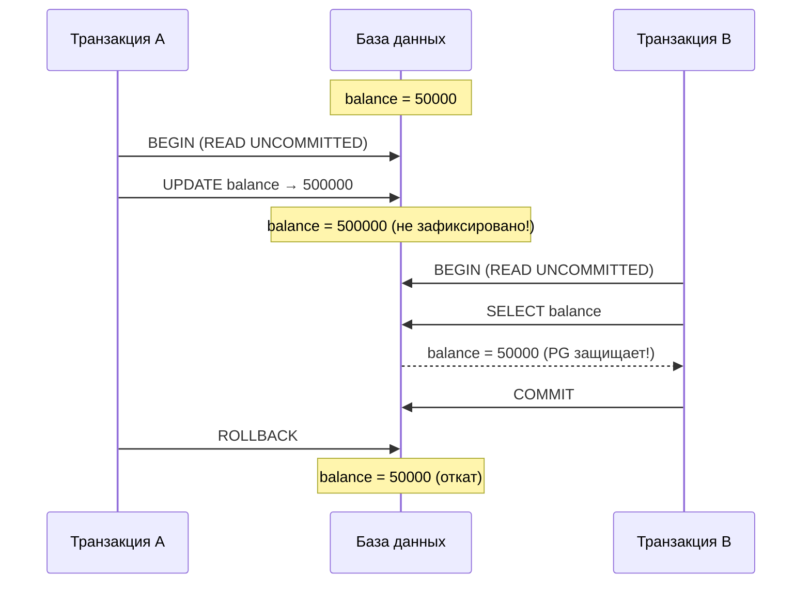
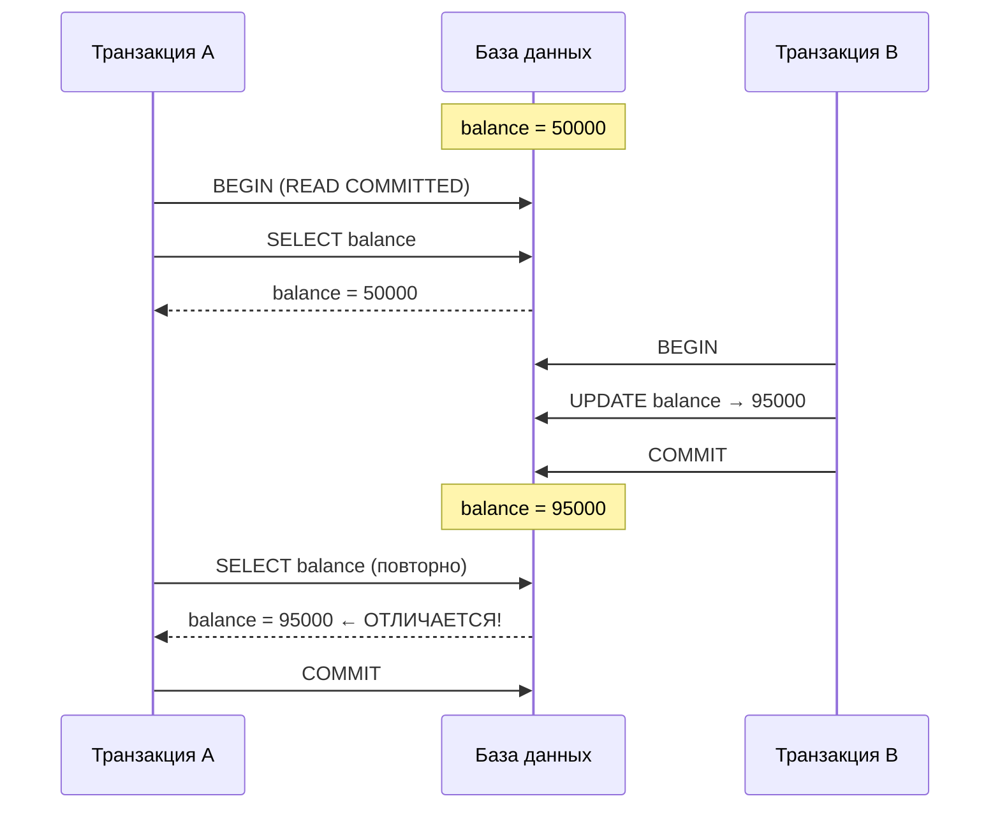
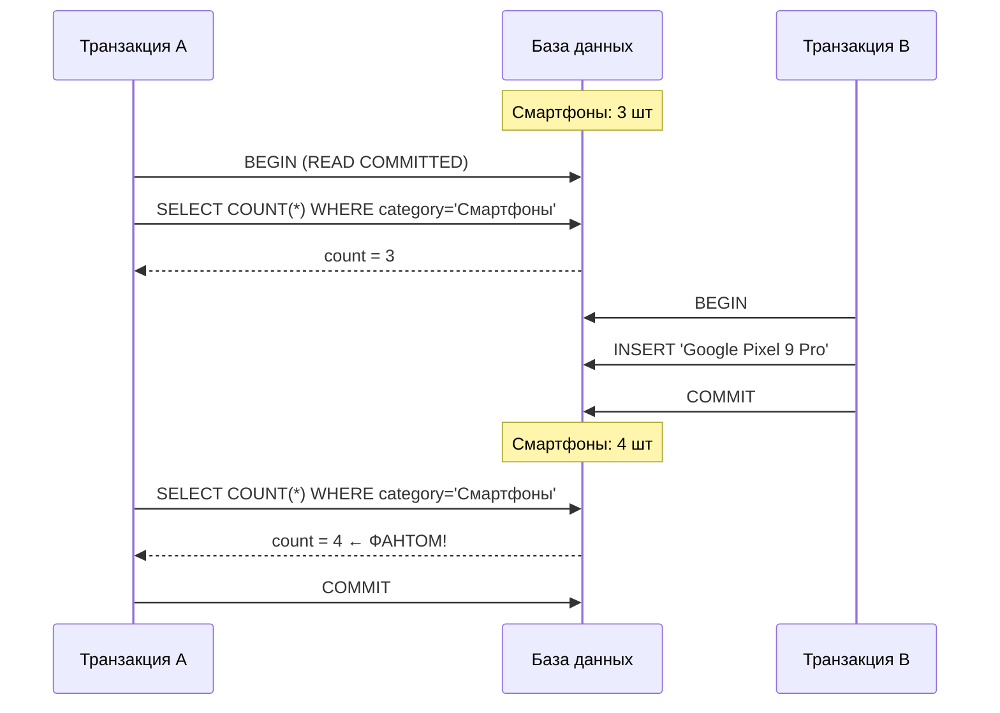
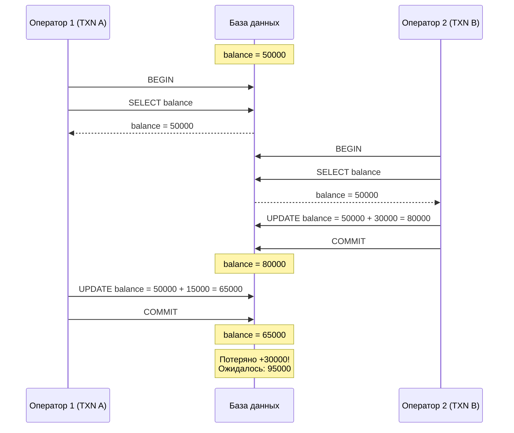

# Отчёт: Аномалии изоляции транзакций в SQL

**СУБД:** PostgreSQL 16 (Docker)  
**Дата:** 07.05.2026  
**Выполнила:** Усачева Ульяна, группа К0709-23/3  

---

## Введение

При параллельной работе нескольких транзакций с БД могут возникать **аномалии изоляции** — ситуации, когда результат работы транзакций отличается от ожидаемого при последовательном выполнении.

| Уровень | Dirty Read | Non-Repeatable Read | Phantom Read | Lost Update |
|---|---|---|---|---|
| READ UNCOMMITTED | Возможна | Возможна | Возможна | Возможна |
| READ COMMITTED | **Нет** | Возможна | Возможна | Возможна |
| REPEATABLE READ | **Нет** | **Нет** | Возможна* | **Нет** |
| SERIALIZABLE | **Нет** | **Нет** | **Нет** | **Нет** |

> [!NOTE]
> В PostgreSQL REPEATABLE READ также предотвращает phantom read (сильнее стандарта SQL).

### Среда выполнения

```
PostgreSQL 16 запущен через Docker:
docker run --name pg-anomalies -e POSTGRES_PASSWORD=postgres -p 5432:5432 -d postgres:16

Тест: Python 3.11 + psycopg2-binary (параллельные потоки)
```

### Тестовые таблицы

```sql
CREATE TABLE accounts (
    id         SERIAL PRIMARY KEY,
    owner      VARCHAR(100) NOT NULL,
    balance    NUMERIC(12,2) NOT NULL DEFAULT 0.00,
    currency   VARCHAR(3) NOT NULL DEFAULT 'RUB',
    created_at TIMESTAMP DEFAULT NOW()
);

-- 8 записей: Иванов Алексей (50000), Петрова Мария (120000), ...

CREATE TABLE products (
    id         SERIAL PRIMARY KEY,
    name       VARCHAR(200) NOT NULL,
    category   VARCHAR(100) NOT NULL,
    price      NUMERIC(10,2) NOT NULL,
    in_stock   BOOLEAN DEFAULT TRUE,
    created_at TIMESTAMP DEFAULT NOW()
);

-- 13 записей: MacBook Pro, iPhone 16 Pro, Samsung Galaxy S25, ...
```

---

## 1. Dirty Read — Грязное чтение

### Описание

Транзакция B читает данные, изменённые транзакцией A, но **ещё не зафиксированные**. Если A откатится — B получила данные, которых **никогда не существовало**.

### Шаги воспроизведения



| Шаг | Терминал 1 (Транзакция A) | Терминал 2 (Транзакция B) |
|-----|---------------------------|---------------------------|
| 1 | `BEGIN; SET TRANSACTION ISOLATION LEVEL READ UNCOMMITTED;` | — |
| 2 | `UPDATE accounts SET balance = 500000 WHERE owner = 'Иванов Алексей';` | — |
| 3 | — | `BEGIN; SET TRANSACTION ISOLATION LEVEL READ UNCOMMITTED;`<br>`SELECT * FROM accounts WHERE owner = 'Иванов Алексей';` |
| 4 | `ROLLBACK;` | — |

### Результат теста

```
[14:39:49.552] TXN_A    | UPDATE balance 50000.0 → 500000.0 (без COMMIT)
[14:39:50.176] TXN_B    | SELECT balance → 50000.00
[14:39:51.373] TXN_A    | ROLLBACK — откатываем изменения
[14:39:51.395] РЕЗУЛЬТАТ | ✓ Dirty read НЕ произошёл. B прочитала 50000.0
[14:39:51.395] РЕЗУЛЬТАТ |   PostgreSQL автоматически защищает от dirty read.
```

> [!IMPORTANT]
> PostgreSQL **НЕ допускает** dirty read даже при `READ UNCOMMITTED` — автоматически повышает до `READ COMMITTED`. В MySQL с InnoDB эта аномалия воспроизводится.

### Как избежать

Уровень изоляции **READ COMMITTED** или выше.

---

## 2. Non-Repeatable Read — Неповторяемое чтение

### Описание

Транзакция A читает строку **дважды** и получает **разные значения**, т.к. между чтениями транзакция B изменила и закоммитила эту строку.

### Шаги воспроизведения



| Шаг | Терминал 1 (Транзакция A) | Терминал 2 (Транзакция B) |
|-----|---------------------------|---------------------------|
| 1 | `BEGIN; SET TRANSACTION ISOLATION LEVEL READ COMMITTED;` | — |
| 2 | `SELECT * FROM accounts WHERE owner = 'Иванов Алексей';` → **50000.00** | — |
| 3 | — | `BEGIN;`<br>`UPDATE accounts SET balance = 95000 WHERE owner = 'Иванов Алексей';`<br>`COMMIT;` |
| 4 | `SELECT * FROM accounts WHERE owner = 'Иванов Алексей';` → **95000.00** ⚠ | — |

### Результат теста

```
[14:39:52.424] TXN_A    | Первое чтение:  balance = 50000.00
[14:39:52.759] TXN_B    | UPDATE balance → 95000.0
[14:39:52.764] TXN_B    | COMMIT выполнен
[14:39:53.066] TXN_A    | Второе чтение:  balance = 95000.00
[14:39:53.101] РЕЗУЛЬТАТ | ⚠ Non-repeatable read ПРОИЗОШЁЛ!
[14:39:53.101] РЕЗУЛЬТАТ |   Первое чтение:  50000.0
[14:39:53.101] РЕЗУЛЬТАТ |   Второе чтение:  95000.0
```

> [!WARNING]
> Два идентичных `SELECT` внутри **одной** транзакции вернули **разные значения**: 50000 и 95000.

### Как избежать

Уровень **REPEATABLE READ** — транзакция видит снимок данных на момент своего начала:

```sql
BEGIN;
SET TRANSACTION ISOLATION LEVEL REPEATABLE READ;
SELECT balance FROM accounts WHERE owner = 'Иванов Алексей'; -- 50000
-- (другая транзакция меняет на 95000 и коммитит)
SELECT balance FROM accounts WHERE owner = 'Иванов Алексей'; -- всё ещё 50000 ✓
COMMIT;
```

---

## 3. Phantom Read — Фантомное чтение

### Описание

Транзакция A выполняет `SELECT` с `WHERE` дважды и получает **разное количество строк**, т.к. между запросами транзакция B вставила новую строку, удовлетворяющую условию.

### Шаги воспроизведения



| Шаг | Терминал 1 (Транзакция A) | Терминал 2 (Транзакция B) |
|-----|---------------------------|---------------------------|
| 1 | `BEGIN; SET TRANSACTION ISOLATION LEVEL READ COMMITTED;` | — |
| 2 | `SELECT COUNT(*), SUM(price) FROM products WHERE category = 'Смартфоны';` → **3 строки** | — |
| 3 | — | `BEGIN;`<br>`INSERT INTO products VALUES ('Google Pixel 9 Pro', 'Смартфоны', 84990);`<br>`COMMIT;` |
| 4 | `SELECT COUNT(*), SUM(price) FROM products WHERE category = 'Смартфоны';` → **4 строки** ⚠ | — |

### Результат теста

```
[14:39:53.149] TXN_A    | Первый SELECT: 3 строк → ['Xiaomi 15 Ultra', 'Samsung Galaxy S25', 'iPhone 16 Pro']
[14:39:53.479] TXN_B    | INSERT 'Google Pixel 9 Pro' в Смартфоны (84990.0₽)
[14:39:53.485] TXN_B    | COMMIT выполнен
[14:39:53.790] TXN_A    | Второй SELECT: 4 строк → ['Xiaomi 15 Ultra', 'Google Pixel 9 Pro', 'Samsung Galaxy S25', 'iPhone 16 Pro']
[14:39:53.817] РЕЗУЛЬТАТ | ⚠ Phantom read ПРОИЗОШЁЛ!
[14:39:53.817] РЕЗУЛЬТАТ |   Первый SELECT:  3 строк
[14:39:53.817] РЕЗУЛЬТАТ |   Второй SELECT:  4 строк
[14:39:53.817] РЕЗУЛЬТАТ |   Строка 'Google Pixel 9 Pro' — это фантом!
```

> [!WARNING]
> Один и тот же `SELECT` вернул **3 строки**, затем **4 строки**. `Google Pixel 9 Pro` — фантомная строка.

### Как избежать

Уровень **SERIALIZABLE** (по стандарту) или **REPEATABLE READ** (в PostgreSQL):

```sql
BEGIN;
SET TRANSACTION ISOLATION LEVEL SERIALIZABLE;
SELECT COUNT(*) FROM products WHERE category = 'Смартфоны'; -- 3
-- (другая транзакция вставляет Google Pixel 9 Pro и коммитит)
SELECT COUNT(*) FROM products WHERE category = 'Смартфоны'; -- всё ещё 3 ✓
COMMIT;
```

---

## 4. Lost Update — Потерянное обновление

### Описание

Две транзакции читают одно значение, каждая вычисляет новое и записывает. Вторая **перезаписывает** результат первой — обновление первой **теряется**.

### Сценарий

Два оператора одновременно пополняют счёт клиента:
- **Оператор 1** добавляет **+15 000** (зарплата)
- **Оператор 2** добавляет **+30 000** (перевод)
- Ожидаемый результат: `50 000 + 15 000 + 30 000 = 95 000`

### Шаги воспроизведения



| Шаг | Терминал 1 (Оператор 1) | Терминал 2 (Оператор 2) |
|-----|-------------------------|-------------------------|
| 1 | `BEGIN;`<br>`SELECT balance FROM accounts WHERE owner = 'Иванов Алексей';` → **50000** | — |
| 2 | — | `BEGIN;`<br>`SELECT balance FROM accounts WHERE owner = 'Иванов Алексей';` → **50000** |
| 3 | — | `UPDATE accounts SET balance = 80000 WHERE owner = 'Иванов Алексей';`<br>`COMMIT;` |
| 4 | `UPDATE accounts SET balance = 65000 WHERE owner = 'Иванов Алексей';`<br>`COMMIT;` | — |

### Результат теста

```
[14:39:54.878] TXN_A (Оператор 1) | Читает balance = 50000.0
[14:39:55.105] TXN_B (Оператор 2) | Читает balance = 50000.0
[14:39:55.105] TXN_B (Оператор 2) | UPDATE balance → 80000.0 (= 50000.0 + 30000.0)
[14:39:55.110] TXN_B (Оператор 2) | COMMIT выполнен
[14:39:55.411] TXN_A (Оператор 1) | UPDATE balance → 65000.0 (= 50000.0 + 15000.0)
[14:39:55.414] TXN_A (Оператор 1) | COMMIT выполнен
[14:39:55.446] РЕЗУЛЬТАТ           | Ожидаемый баланс:    95000.0
[14:39:55.446] РЕЗУЛЬТАТ           | Фактический баланс:  65000.0
[14:39:55.446] РЕЗУЛЬТАТ           | ⚠ Lost update ПРОИЗОШЁЛ! Потеряно: 30000.0
```

> [!CAUTION]
> Перевод оператора 2 (+30 000) **полностью потерян**! Ожидалось 95 000, получено 65 000.

### Как избежать

**Способ 1** — `SELECT ... FOR UPDATE` (пессимистичная блокировка):
```sql
BEGIN;
SELECT balance FROM accounts WHERE owner = 'Иванов Алексей' FOR UPDATE;
UPDATE accounts SET balance = balance + 15000 WHERE owner = 'Иванов Алексей';
COMMIT;
```

**Способ 2** — Атомарное обновление:
```sql
UPDATE accounts SET balance = balance + 15000 WHERE owner = 'Иванов Алексей';
```

**Способ 3** — Уровень `SERIALIZABLE` (ошибка сериализации при конфликте).

---

## Как избежать аномалий — сводка

| Аномалия | Минимальный уровень | Альтернатива |
|---|---|---|
| Dirty Read | `READ COMMITTED` | В PG невозможна в принципе |
| Non-Repeatable Read | `REPEATABLE READ` | — |
| Phantom Read | `SERIALIZABLE` | В PG — `REPEATABLE READ` |
| Lost Update | `SERIALIZABLE` | `SELECT FOR UPDATE` / атомарные операции |

Дополнительные методы:
- **Пессимистичная блокировка**: `SELECT ... FOR UPDATE`
- **Оптимистичная блокировка**: поле `version` + проверка при UPDATE
- **Атомарные операции**: `UPDATE SET balance = balance + N`

---

## Итоговая сводка результатов

| Аномалия | Воспроизведена? | Способ предотвращения |
|---|---|---|
| Dirty Read | Нет (PG защищён) | READ COMMITTED и выше |
| Non-Repeatable Read | **Да** ⚠ | REPEATABLE READ |
| Phantom Read | **Да** ⚠ | SERIALIZABLE / REPEATABLE READ* |
| Lost Update | **Да** ⚠ | SELECT FOR UPDATE / атомарные |

> [!TIP]
> На практике лучший подход — комбинировать правильный уровень изоляции с атомарными SQL-операциями и явными блокировками (`FOR UPDATE`).

## Файлы проекта

| Файл | Описание |
|---|---|
| `sql/00_setup.sql` | Создание таблиц и тестовых данных |
| `sql/01_dirty_read.sql` | Сценарий Dirty Read |
| `sql/02_non_repeatable_read.sql` | Сценарий Non-Repeatable Read |
| `sql/03_phantom_read.sql` | Сценарий Phantom Read |
| `sql/04_lost_update.sql` | Сценарий Lost Update |
| `run_anomalies.py` | Автоматический скрипт (Python + psycopg2) |
